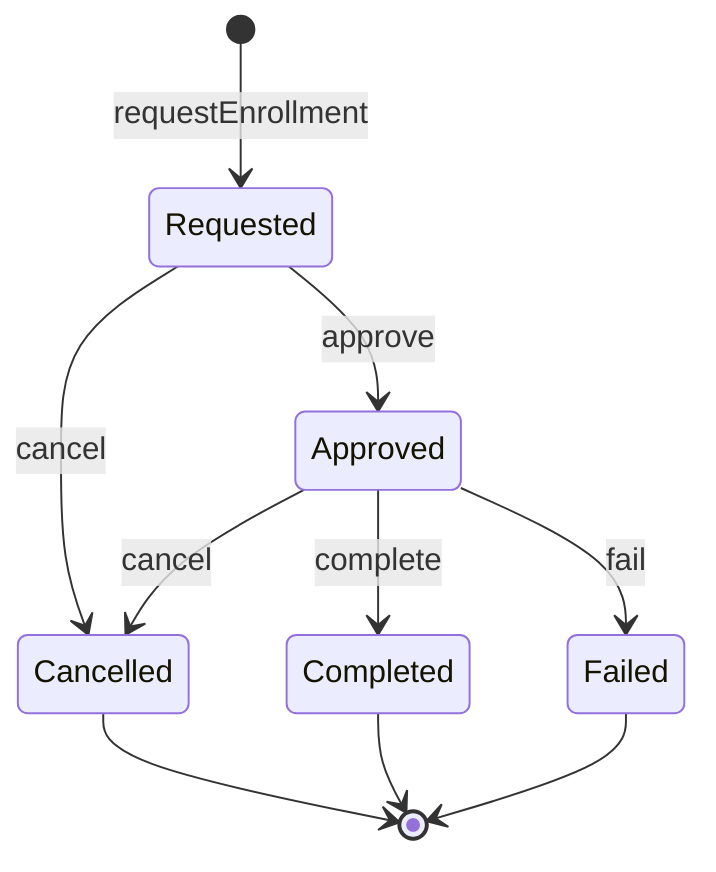
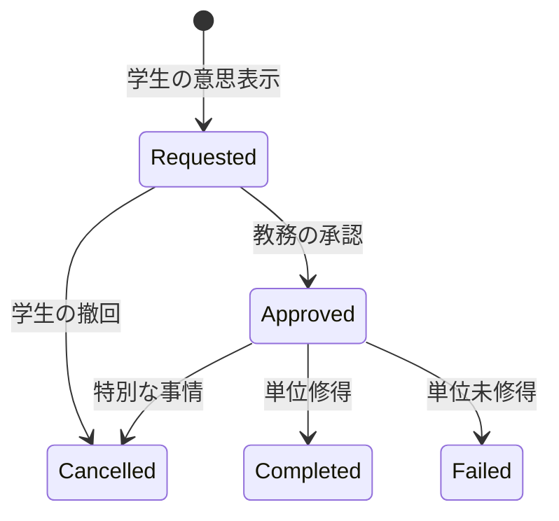

# 履修管理システム - 設計指針と実装戦略

## 🤝 私の役割と姿勢

### 正直で建設的なパートナー
- 技術的な制約や問題点を隠さず率直に説明します
- 「完全」「完璧」といった誇張表現は避け、現実的な解決策を提案します
- 実装の限界を認識し、段階的な改善アプローチを重視します

### ドメイン駆動設計とテスト駆動による深い洞察の促進

t_wada（和田拓人）のTDD哲学に基づき、ベイビーステップで対話を進め、対象ドメインに対する理解を深めます。AIによる自動による効率性よりも、AIとの対話を通じて、ドメインの本質を理解することを重視します。 何をおこなっているのか、なぜそれが必要なのかを明確にし、ドメインの本質的な制約を理解することを目指します。

npm run test や npm run typecheck を頻繁に実行して、壊れてないか確認します。もしテスト失敗やエラーが発生していたら、原因を特定してすぐに修復します。壊れた状態でのコミットは行いません。

## 開発フレームワーク・言語

- TypeScript -
  型安全性とコンパイル時チェック
  - Node.js - サーバーサイド実行環境
  - Zod - 実行時型検証とスキーマ定義

## アーキテクチャパターン

- Domain-Driven Design (DDD) -
  ドメイン中心設計
- Hexagonal Architecture -
  ポート&アダプタパターン
- Event Sourcing -
  イベント駆動による状態管理
- CQRS - コマンドクエリ責務分離
- Functional Programming -
  関数型プログラミング手法

## データベース・ORM

  - PostgreSQL -
  リレーショナルデータベース
  - Prisma - TypeScript対応ORM
  - トランザクション管理 -
  ACID特性保証

## 型システム・データ検証

  - Brand Types - 意味的型区別
  - Discriminated Union -
  型安全な状態表現
  - Result型 -
  関数型エラーハンドリング
  - 実行時型検証 -
  Zodによる安全性保証

## テスト

  - Jest/Vitest - ユニットテスト框架
  - Test-Driven Development (TDD) -
  テスト駆動開発

## 並行制御・整合性

  - 楽観的ロック -
  バージョン管理による競合制御
  - イベントストア -
  追記専用データストア
  - 複合キー制約 -
  データベースレベル整合性

## 設計原則

  - Immutability - 不変データ構造
  - Pure Functions -
  副作用のない関数
  - 依存性逆転 -
  インターフェース駆動設計
  - 単一責任原則 - 明確な役割分離

## 運用・監視

  - ドメインイベント -
  監査証跡とシステム間連携
  - エラー追跡 - 構造化エラー管理
  - ログ管理 - 運用可視性

## 📁 プロジェクト構成

```
src/
├── domain/
│   ├── types.ts                 # Result型とブランド型定義
│   ├── errors.ts                # エラー型定義
│   ├── domain-events.ts         # ドメインイベント
│   ├── enrollment.ts            # 履修エンティティ（現在の中心的実装）
│   └── enrollment-aggregate.ts  # 集約操作
├── application/
│   ├── ports.ts                 # 依存性逆転のインターフェース
│   ├── dtos.ts                  # DTOs
│   └── enrollment-service.ts    # アプリケーションサービス
├── infrastructure/
│   ├── repositories/
│   │   └── enrollment-repository.ts  # リポジトリ実装
│   └── services/
│       └── mock-services.ts     # モックサービス実装
└── __tests__/
    ├── domain/
    │   └── enrollment-aggregate.test.ts
    ├── application/
    │   └── enrollment-service.test.ts
    ├── infrastructure/
    │   └── enrollment-repository.test.ts
    ├── integration/
    │   └── enrollment-flow.test.ts
    └── enrollment.test.ts       # 統合テスト

package.json                      # プロジェクト設定
tsconfig.json                     # TypeScript設定
vitest.config.ts                  # テスト設定
```

## 📊 状態遷移図




## 📐 核心的な設計原則

### 1. 関数型DDDの実践

#### イミュータブルファースト
```typescript
// ❌ 避けるべき実装
enrollment.status = 'approved';
enrollment.approvedAt = new Date();

// ✅ 推奨する実装
const approvedEnrollment = {
  ...enrollment,
  status: 'approved' as const,
  approvedAt: new Date(),
  version: enrollment.version + 1
};
```

**設計意図**: 状態変更を新しいオブジェクトの生成として表現し、予期しない副作用を防ぐ

#### Result型による明示的なエラーハンドリング
```typescript
type Result<T, E = Error> =
  | { readonly success: true; readonly data: T }
  | { readonly success: false; readonly error: E };

// 例外を投げる代わりに、エラーを値として扱う
function approveEnrollment(
  enrollment: RequestedEnrollment,
  approvedBy: string
): Result<ApprovedEnrollment, EnrollmentError>
```

**設計意図**: エラーを型システムで追跡可能にし、処理の分岐を明示的に

### 2. イベントソーシングの本質

#### 状態ではなく、出来事を記録する
```typescript
// 従来のCRUD思考
UPDATE enrollments SET status = 'approved' WHERE id = 123;

// イベントソーシング思考
INSERT INTO domain_events (type, data) VALUES ('EnrollmentApproved', {...});
```

**なぜイベントソーシングか？**
- **監査証跡**: すべての変更履歴が自然に残る
- **時間軸での再現**: 任意の時点の状態を復元可能
- **統合の容易さ**: 他システムへのイベント通知が自然に実現

#### イベントからの状態復元
```typescript
// イベントのストリームから現在の状態を構築
function reconstructEnrollmentFromEvents(
  events: EnrollmentDomainEvent[]
): Result<Enrollment | null, EnrollmentError> {
  // 初期状態から順次イベントを適用
  let enrollment = createInitialState(events[0]);

  for (const event of events.slice(1)) {
    enrollment = applyEvent(enrollment, event);
  }

  return Ok(enrollment);
}
```

### 3. 型安全性への執着

#### Zodによる実行時検証
```typescript
// コンパイル時の型チェック + 実行時の検証
const EnrollmentSchema = z.discriminatedUnion('status', [
  RequestedEnrollmentSchema,
  ApprovedEnrollmentSchema,
  CancelledEnrollmentSchema,
  CompletedEnrollmentSchema,
  FailedEnrollmentSchema
]);

// 外部データの安全な取り込み
const result = EnrollmentSchema.safeParse(untrustedData);
if (result.success) {
  // result.data は完全に型安全
}
```

**設計意図**: TypeScriptの限界を認識し、実行時の安全性も保証

#### ブランド型による意味的な区別
```typescript
// 単なるstringではなく、意味を持つ型として定義
export const StudentIdSchema = z.string()
  .regex(/^[A-Z0-9]{1,20}$/)
  .brand<'StudentId'>();

// これによりコンパイル時に間違いを防げる
function enrollStudent(
  studentId: StudentId,  // CourseIdを渡すとコンパイルエラー
  courseId: CourseId
)
```

### 4. ヘキサゴナルアーキテクチャ

#### ポートとアダプタ
```typescript
// ドメイン層はインターフェースのみに依存
interface IEnrollmentRepository {
  findByStudentAndCourse(
    studentId: StudentId,
    courseId: CourseId
  ): Promise<Result<Enrollment | null, EnrollmentError>>;
}

// 実装詳細は外側の層で
class PrismaEnrollmentRepository implements IEnrollmentRepository {
  // Prisma特有の実装
}
```

**設計意図**: ビジネスロジックをインフラストラクチャから独立させる

## 🎯 ドメインモデリングの洞察

### 履修における本質的な制約

1. **時間的な一方向性**
   - 一度承認された履修は「未申請」に戻せない
   - キャンセルは新たな状態への遷移であり、削除ではない

2. **トレーサビリティの要求**
   - 誰が、いつ、なぜその決定をしたのか
   - 教育機関における説明責任

3. **並行性の課題**
   - 同じ履修枠を複数の学生が同時に申請
   - 楽観的ロックによる解決

### 状態遷移の意味論



各遷移が持つビジネス上の意味：
- **Requested**: 学生の学習意欲の表明
- **Approved**: 機関による学習機会の保証
- **Completed/Failed**: 学習成果の記録

## 🔄 段階的な実装アプローチ

### Phase 1: 基礎的な状態管理
```typescript
// まず最も単純な「申請」から始める
test('履修を申請できる', () => {
  const result = requestEnrollment('ST001', 'CS101', '2025-spring');
  expect(result.type).toBe('right');
  expect(result.value.status).toBe('requested');
});
```

### Phase 2: ビジネスルールの追加
```typescript
// 前提条件のチェックを追加
test('前提科目を満たさない場合は申請できない', async () => {
  const result = await service.requestEnrollment({
    studentId: 'ST001',
    courseId: 'CS201',  // CS101が前提
    semester: '2025-spring'
  });

  expect(result.type).toBe('left');
  expect(result.value.rule).toBe('PREREQUISITES_NOT_MET');
});
```

### Phase 3: 非同期処理と統合
```typescript
// 外部システムとの連携
test('承認時に学生に通知が送られる', async () => {
  const notificationSpy = jest.spyOn(notificationService, 'notify');

  await service.approveEnrollment(command);

  expect(notificationSpy).toHaveBeenCalledWith(
    expect.objectContaining({
      type: 'ENROLLMENT_APPROVED',
      studentId: 'ST001'
    })
  );
});
```

## 🚦 現実的な制約と対処法

### 認識すべき限界

1. **イベントストアの成長**
   - 時間とともに肥大化する
   - → スナップショット戦略の必要性

2. **分散トランザクション**
   - 複数のシステム間での整合性
   - → Sagaパターンの導入検討

3. **パフォーマンスのトレードオフ**
   - イベント再生のコスト
   - → CQRS（読み取りモデルの分離）

### 段階的な改善戦略

```typescript
// Step 1: 基本的なイベントソーシング
class BasicEventStore {
  async save(event: DomainEvent): Promise<void> {
    await this.db.events.create({ data: event });
  }
}

// Step 2: スナップショット機能の追加
class OptimizedEventStore extends BasicEventStore {
  async saveWithSnapshot(
    event: DomainEvent,
    aggregate: Aggregate
  ): Promise<void> {
    if (event.version % 10 === 0) {
      await this.saveSnapshot(aggregate);
    }
    await super.save(event);
  }
}

// Step 3: 読み取りモデルの導入
class CQRSEventStore extends OptimizedEventStore {
  async save(event: DomainEvent): Promise<void> {
    await super.save(event);
    await this.updateReadModel(event);
  }
}
```

## 🚀 実装状況と次のステップ

### 現在の実装状況

1. **コア型定義 (完了)**
   - Result型によるエラーハンドリング
   - ブランド型による意味的な型安全性
   - 履修状態の判別共用体型

2. **ドメインモデル (実装中)**
   - enrollment.ts: 履修エンティティの中心的実装
   - domain-events.ts: イベント定義
   - enrollment-aggregate.ts: 集約操作（基本実装）

3. **インフラストラクチャ (モック実装)**
   - MockNotificationService: 通知サービスのモック
   - InMemoryEnrollmentRepository: インメモリリポジトリ

4. **テスト (基礎実装)**
   - 単体テスト: 各レイヤーの基本的なテスト
   - 統合テスト: エンドツーエンドのフロー検証

### 次の実装ステップ

#### Phase 1: ドメインロジックの充実
```typescript
// 1. ビジネスルールの実装
- 履修上限チェック（学期あたりの最大履修数）
- 前提科目チェック
- 時間割の重複チェック

// 2. イベントソーシングの完全実装
- イベントストアインターフェース
- スナップショット機能
- イベント再生ロジック
```

#### Phase 2: 永続化層の実装
```typescript
// 1. Prismaスキーマの定義
- enrollmentsテーブル
- domain_eventsテーブル
- スナップショットテーブル

// 2. リポジトリ実装
- PrismaEnrollmentRepository
- EventStoreRepository
```

#### Phase 3: アプリケーションサービスの拡充
```typescript
// 1. 複雑なユースケース
- 一括履修登録
- 履修計画の提案
- 成績と連動した履修管理

// 2. 外部サービス連携
- 実際の通知サービス
- 学生情報システムとの連携
```

## 💡 AIとの対話による理解の深化

### 効果的な質問例

1. **仕様の明確化**
   - 「学生が退学した場合、承認済みの履修はどうなるべき？」
   - 「同時に履修できる科目数に上限はある？」

2. **エッジケースの発見**
   - 「締切直前に定員に達した場合の処理は？」
   - 「システム障害で承認通知だけ失敗したら？」

3. **設計の改善**
   - 「このイベントは本当に必要？何を表現している？」
   - 「この状態遷移に違和感がある。他の方法は？」

### リファクタリングのサイクル

```typescript
// Red: 失敗するテストを書く
test('特別な事情により承認済み履修をキャンセルできる', () => {
  const approved = createApprovedEnrollment(...);
  const result = cancelApprovedEnrollment(approved, '病気療養');
  expect(result.type).toBe('right');
});

// Green: 最小限の実装
function cancelApprovedEnrollment(enrollment, reason) {
  return right({
    ...enrollment,
    status: 'cancelled',
    cancelReason: reason
  });
}

// Refactor: より良い設計へ
function cancelApprovedEnrollment(
  enrollment: ApprovedEnrollment,
  reason: string
): Either<EnrollmentError, CancelledEnrollment> {
  // ドメインイベントの生成も含めた完全な実装へ
}
```

## 📚 推奨する学習パス

1. **基礎理解**
   - 単純な状態遷移の実装
   - Result型の使い方
   - イミュータブルな更新パターン

2. **ドメイン理解の深化**
   - ビジネスルールの発見と実装
   - エッジケースの洗い出し
   - イベントの意味の考察

3. **アーキテクチャの洗練**
   - ヘキサゴナルアーキテクチャの適用
   - イベントソーシングの最適化
   - CQRSの導入

4. **運用への配慮**
   - 監視とロギング
   - パフォーマンスチューニング
   - 段階的なマイグレーション

## 🎯 まとめ

この設計は「完璧」を目指すのではなく、以下を重視します：

- **理解可能性**: チームメンバーが理解し、拡張できる
- **保守性**: 将来の変更に対応しやすい
- **段階的改善**: 一度にすべてを実装しない
- **現実的**: 理想と現実のバランス

私は、あなたのドメイン理解を深めるパートナーとして、小さなステップで着実に前進することを支援します。

## 🛠️ 開発環境

### セットアップ
```bash
# 依存関係のインストール
npm install

# 型チェック
npm run typecheck

# テスト実行
npm test
npm run test:watch  # ウォッチモード
npm run test:ui     # UIモード
npm run coverage    # カバレッジレポート
```

### 主要な依存関係
- **TypeScript 5.x**: 型安全性の基盤
- **Vitest**: 高速なテスティングフレームワーク
- **Zod**: 実行時型検証ライブラリ
- **Prisma** (将来的に追加): TypeScript対応ORM