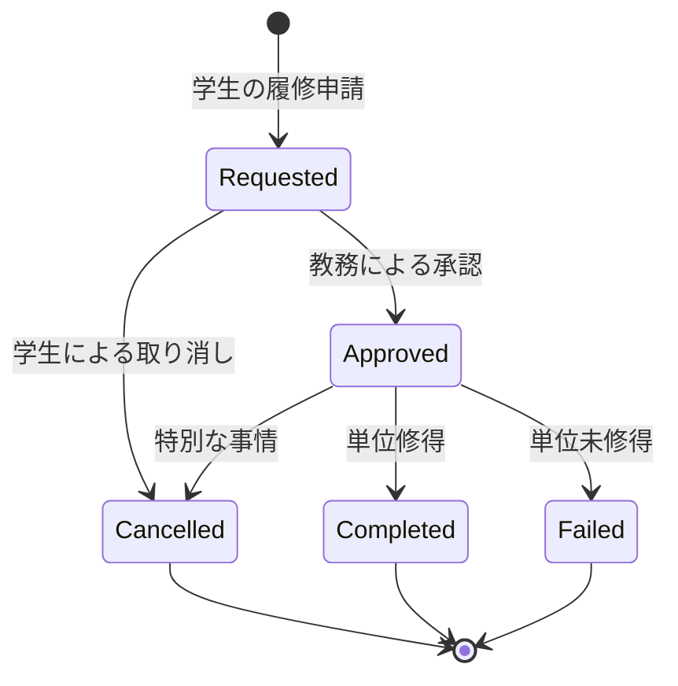

# 履修管理システム - 関数型DDD実装サンプル

## 🎯 このサンプルの目的

このプロジェクトは、関数型プログラミングとドメイン駆動設計（DDD）を組み合わせた現実的な実装例を提供します。理論的な「完璧さ」よりも、実際のプロジェクトで使える実践的なアプローチを重視しています。

## 🤝 設計思想と制約の正直な説明

### 採用した設計判断

1. **Result型 vs Either型**
   - Either型の代わりにより直感的なResult型を採用
   - `success/error`という明確な状態と`data/error`での値管理
   - TypeScriptエコシステムとの親和性を重視

2. **段階的実装**
   - すべてを一度に実装せず、コア機能から開始
   - モック実装で外部依存を切り離し
   - 実用的な範囲でのイベントソーシング

3. **現実的なトレードオフ**
   - 完全なイベントストアよりもシンプルな永続化
   - 型安全性とパフォーマンスのバランス
   - 運用コストを考慮した設計選択

## 📁 実際のプロジェクト構成

```
src/
├── domain/                      # ドメイン層
│   ├── types.ts                 # Result型とブランド型定義
│   ├── errors.ts                # 構造化エラー型
│   ├── domain-events.ts         # ドメインイベント
│   ├── enrollment.ts            # 履修エンティティ（中心実装）
│   └── enrollment-aggregate.ts  # 集約操作
├── application/                 # アプリケーション層
│   ├── ports.ts                 # 依存性逆転インターフェース
│   ├── dtos.ts                  # データ転送オブジェクト
│   └── enrollment-service.ts    # アプリケーションサービス
├── infrastructure/              # インフラ層
│   ├── repositories/
│   │   └── enrollment-repository.ts  # データ永続化
│   └── services/
│       └── mock-services.ts     # モック実装
└── __tests__/                   # テスト
    ├── domain/
    ├── application/
    ├── infrastructure/
    └── integration/
```

## 🔧 技術スタック

### 開発環境
- **TypeScript 5.x**: 型安全性の基盤
- **Node.js**: サーバーサイド実行環境
- **Vitest**: 高速テスティングフレームワーク
- **Zod**: 実行時型検証ライブラリ

### アーキテクチャパターン
- **Domain-Driven Design**: ビジネスロジック中心設計
- **Hexagonal Architecture**: ポート&アダプタパターン
- **Event Sourcing**: 履歴ベースの状態管理（簡易版）
- **Functional Programming**: 関数型プログラミング手法

## 🚀 実装の核心概念

### 1. Result型による安全なエラーハンドリング

現在の実装では、Either型の代わりにより直感的なResult型を使用：

```typescript
// Result型の定義
export type Result<T, E = Error> = 
  | { readonly success: true; readonly data: T }
  | { readonly success: false; readonly error: E };

// ファクトリ関数
export const Ok = <T, E = Error>(data: T): Result<T, E> => ({
  success: true,
  data
});

export const Err = <T, E = Error>(error: E): Result<T, E> => ({
  success: false,
  error
});

// 実使用例
function requestEnrollment(
  studentId: string,
  courseId: string,
  semester: string
): Result<RequestedEnrollment, EnrollmentError> {
  // バリデーション
  const studentIdResult = StudentIdSchema.safeParse(studentId);
  if (!studentIdResult.success) {
    return Err({
      type: 'VALIDATION_ERROR',
      message: `Invalid student ID: ${studentId}`
    });
  }

  // 成功ケース
  return Ok({
    studentId: studentIdResult.data,
    courseId,
    semester,
    status: 'requested',
    requestedAt: new Date(),
    version: 1
  });
}
```

### 2. ブランド型による意味的な型安全性

単なる文字列ではなく、ドメインの意味を持つ型として定義：

```typescript
// Zodによるブランド型定義
export const StudentIdSchema = z.string()
  .regex(/^ST[0-9]{3}$/, "学生IDは 'ST' + 3桁数字")
  .brand<'StudentId'>();

export const CourseIdSchema = z.string()
  .regex(/^[A-Z]{2}[0-9]{3}$/, "科目IDは2文字 + 3桁数字")
  .brand<'CourseId'>();

export const SemesterSchema = z.string()
  .regex(/^\d{4}-(spring|summer|fall|winter)$/, "学期は 'YYYY-season' 形式")
  .brand<'Semester'>();

export type StudentId = z.infer<typeof StudentIdSchema>;
export type CourseId = z.infer<typeof CourseIdSchema>;
export type Semester = z.infer<typeof SemesterSchema>;

// 使用例：コンパイル時に型チェック
function enrollStudent(
  studentId: StudentId,  // CourseIdを渡すとコンパイルエラー
  courseId: CourseId,
  semester: Semester
) {
  // 実装
}
```

### 3. 判別共用体による状態管理

TypeScriptの判別共用体を活用した型安全な状態表現：

```typescript
// 各状態の型定義
export interface RequestedEnrollment {
  readonly studentId: StudentId;
  readonly courseId: CourseId;
  readonly semester: Semester;
  readonly status: 'requested';
  readonly requestedAt: Date;
  readonly version: number;
}

export interface ApprovedEnrollment {
  readonly studentId: StudentId;
  readonly courseId: CourseId;
  readonly semester: Semester;
  readonly status: 'approved';
  readonly requestedAt: Date;
  readonly approvedAt: Date;
  readonly approvedBy: string;
  readonly version: number;
}

// 判別共用体
export type Enrollment = 
  | RequestedEnrollment
  | ApprovedEnrollment
  | CancelledEnrollment
  | CompletedEnrollment
  | FailedEnrollment;

// 型ガード
export const isRequested = (e: Enrollment): e is RequestedEnrollment => 
  e.status === 'requested';

export const isApproved = (e: Enrollment): e is ApprovedEnrollment => 
  e.status === 'approved';

// 型安全な状態遷移
function approveEnrollment(
  enrollment: Enrollment,
  approvedBy: string
): Result<ApprovedEnrollment, EnrollmentError> {
  if (!isRequested(enrollment)) {
    return Err({
      type: 'INVALID_STATE_TRANSITION',
      message: `Cannot approve from status: ${enrollment.status}`,
      fromStatus: enrollment.status,
      toStatus: 'approved'
    });
  }
  
  return Ok({
    ...enrollment,
    status: 'approved',
    approvedAt: new Date(),
    approvedBy,
    version: enrollment.version + 1
  });
}
```

## 📊 ドメインモデルの設計判断

### CourseIdとSemesterの分離戦略

#### なぜ学期込みCourseIdではないのか？

```typescript
// ❌ 避けたアプローチ
const courseId = "MATH101-2024-SPRING";  // 学期込みの識別子

// ✅ 採用したアプローチ
const courseId: CourseId = "MATH101";     // 科目の本質的な識別子
const semester: Semester = "2024-spring"; // 時間軸での開講
```

#### 分離による利点

1. **概念の明確な分離**
```typescript
// 科目カタログ（恒久的な情報）
interface Course {
  courseId: CourseId;        // MATH101
  title: string;            // "数学I"
  credits: number;          // 2単位
  prerequisites: CourseId[]; // 前提科目
}

// 開講スケジュール（学期ごとの情報）
interface CourseOffering {
  courseId: CourseId;   // MATH101
  semester: Semester;   // 2024-spring
  instructor: string;   // 担当教員（学期ごとに変動）
  capacity: number;     // 定員（学期ごとに変動）
  room: string;         // 教室（学期ごとに変動）
}
```

2. **柔軟なクエリと分析**
```typescript
// 学期横断での履修パターン分析
function getCourseEnrollmentHistory(courseId: CourseId): Promise<Enrollment[]> {
  return findEnrollmentsByCourse(courseId); // 全学期のMATH101履修者
}

// 特定学期の履修負荷分析
function getSemesterWorkload(semester: Semester): Promise<Enrollment[]> {
  return findEnrollmentsBySemester(semester); // 2024春学期の全履修
}

// 特定開講インスタンスの管理
function getSpecificEnrollment(
  studentId: StudentId,
  courseId: CourseId,
  semester: Semester
): Promise<Enrollment | null> {
  return findEnrollment(studentId, courseId, semester);
}
```

### 状態遷移と業務制約



各遷移のビジネス意味：
- **Requested → Approved**: 履修条件（前提科目、定員、GPA）の確認と承認
- **Approved → Cancelled**: 病気、転学などの特別な事情による取り消し
- **Approved → Completed/Failed**: 学期終了時の成績評価結果

## 🔄 関数型プログラミングの実践

### Result型のチェーン操作

```typescript
// Result型のユーティリティ関数
export namespace Result {
  // Functor: 成功値を変換
  export const map = <T, U, E>(
    result: Result<T, E>,
    fn: (data: T) => U
  ): Result<U, E> => {
    return result.success ? Ok(fn(result.data)) : result;
  };

  // Monad: Result型を返す関数でチェーン
  export const flatMap = <T, U, E>(
    result: Result<T, E>,
    fn: (data: T) => Result<U, E>
  ): Result<U, E> => {
    return result.success ? fn(result.data) : result;
  };

  // 非同期チェーン
  export const flatMapAsync = async <T, U, E>(
    result: Result<T, E>,
    fn: (data: T) => Promise<Result<U, E>>
  ): Promise<Result<U, E>> => {
    return result.success ? await fn(result.data) : result;
  };
}

// 実使用例：履修申請処理のチェーン
async function processEnrollmentRequest(
  studentId: string,
  courseId: string,
  semester: string
): Promise<Result<EnrollmentDto, EnrollmentError>> {
  
  // 入力検証
  const validatedInput = validateEnrollmentInput(studentId, courseId, semester);
  
  if (!validatedInput.success) {
    return validatedInput;
  }

  // ビジネスルールチェック（並列）
  const [studentInfo, courseInfo] = await Promise.all([
    validateStudent(validatedInput.data.studentId),
    validateCourse(validatedInput.data.courseId)
  ]);

  // Result型でのチェーン処理
  return Result.flatMap(
    combineResults(studentInfo, courseInfo),
    ([student, course]) => 
      Result.flatMap(
        checkBusinessRules(student, course, validatedInput.data),
        (validation) =>
          Result.map(
            createEnrollmentRequest(validatedInput.data),
            (enrollment) => toEnrollmentDto(enrollment)
          )
      )
  );
}
```

### イミュータブルなデータ更新

```typescript
// ❌ 破壊的な更新（避けるべき）
function approveEnrollmentMutable(enrollment: RequestedEnrollment, approvedBy: string) {
  enrollment.status = 'approved';  // 元のオブジェクトを変更
  enrollment.approvedAt = new Date();
  enrollment.version++;
  return enrollment;
}

// ✅ イミュータブルな更新（推奨）
function approveEnrollmentImmutable(
  enrollment: RequestedEnrollment, 
  approvedBy: string
): ApprovedEnrollment {
  return {
    ...enrollment,           // 既存フィールドをコピー
    status: 'approved',      // 新しい状態
    approvedAt: new Date(),  // 追加フィールド
    approvedBy,
    version: enrollment.version + 1  // バージョン更新
  };
}
```

## 🏗️ レイヤードアーキテクチャ

### ドメイン層（Domain Layer）

```typescript
// domain/enrollment.ts - ビジネスロジックの中核
export function requestEnrollment(
  studentId: string,
  courseId: string,
  semester: string
): Result<RequestedEnrollment, EnrollmentError> {
  // 入力検証
  const validatedStudentId = StudentIdSchema.safeParse(studentId);
  if (!validatedStudentId.success) {
    return Err({ 
      type: 'VALIDATION_ERROR', 
      message: `Invalid student ID: ${studentId}` 
    });
  }

  // ドメインオブジェクトの生成
  return Ok({
    studentId: validatedStudentId.data,
    courseId: validatedStudentId.data,
    semester: validatedStudentId.data,
    status: 'requested',
    requestedAt: new Date(),
    version: 1
  });
}
```

### アプリケーション層（Application Layer）

```typescript
// application/enrollment-service.ts - ユースケースの調整
export class EnrollmentService {
  constructor(
    private readonly repository: IEnrollmentRepository,
    private readonly studentSystem: IStudentSystemAdapter,
    private readonly courseSystem: ICourseSystemAdapter,
    private readonly notificationService: INotificationService
  ) {}

  async requestEnrollment(
    command: RequestEnrollmentCommand
  ): Promise<Result<EnrollmentDto, EnrollmentError>> {
    
    // 1. ドメインロジックの実行
    const enrollmentResult = requestEnrollment(
      command.studentId,
      command.courseId,
      command.semester
    );
    
    if (!enrollmentResult.success) {
      return enrollmentResult;
    }

    // 2. 外部システムとの協調
    const businessRulesCheck = await this.checkBusinessRules(
      enrollmentResult.data
    );
    
    if (!businessRulesCheck.success) {
      return businessRulesCheck;
    }

    // 3. 永続化
    const saveResult = await this.repository.save(enrollmentResult.data);
    
    if (!saveResult.success) {
      return saveResult;
    }

    // 4. 副作用（通知など）
    this.notificationService.notifyEnrollmentRequested(
      enrollmentResult.data.studentId,
      enrollmentResult.data.courseId
    ).catch(err => console.error('Notification failed:', err));

    return Ok(toEnrollmentDto(enrollmentResult.data));
  }
}
```

### インフラストラクチャ層（Infrastructure Layer）

```typescript
// infrastructure/repositories/enrollment-repository.ts
export class InMemoryEnrollmentRepository implements IEnrollmentRepository {
  private enrollments = new Map<string, Enrollment>();
  
  async save(enrollment: Enrollment): Promise<Result<void, EnrollmentError>> {
    try {
      const key = `${enrollment.studentId}-${enrollment.courseId}`;
      this.enrollments.set(key, enrollment);
      return Ok(undefined);
    } catch (error) {
      return Err({
        type: 'PERSISTENCE_ERROR',
        message: `Failed to save enrollment: ${error}`
      });
    }
  }

  async findByStudentAndCourse(
    studentId: StudentId,
    courseId: CourseId
  ): Promise<Result<Enrollment | null, EnrollmentError>> {
    try {
      const key = `${studentId}-${courseId}`;
      const enrollment = this.enrollments.get(key) || null;
      return Ok(enrollment);
    } catch (error) {
      return Err({
        type: 'PERSISTENCE_ERROR',
        message: `Failed to find enrollment: ${error}`
      });
    }
  }
}
```

## 🧪 テスト戦略

### ドメインロジックのテスト

```typescript
// __tests__/domain/enrollment.test.ts
import { describe, test, expect } from 'vitest';
import { requestEnrollment } from '../../src/domain/enrollment.js';

describe('履修申請ドメインロジック', () => {
  test('正常な履修申請を作成できる', () => {
    const result = requestEnrollment('ST001', 'CS101', '2025-spring');
    
    expect(result.success).toBe(true);
    if (result.success) {
      expect(result.data.status).toBe('requested');
      expect(result.data.studentId).toBe('ST001');
      expect(result.data.courseId).toBe('CS101');
      expect(result.data.version).toBe(1);
    }
  });

  test('無効な学生IDの場合はエラーを返す', () => {
    const result = requestEnrollment('INVALID', 'CS101', '2025-spring');
    
    expect(result.success).toBe(false);
    if (!result.success) {
      expect(result.error.type).toBe('VALIDATION_ERROR');
      expect(result.error.message).toContain('Invalid student ID');
    }
  });
});
```

### サービス層の統合テスト

```typescript
// __tests__/application/enrollment-service.test.ts
describe('履修申請サービス', () => {
  let service: EnrollmentService;
  let mockRepository: IEnrollmentRepository;
  let mockStudentSystem: IStudentSystemAdapter;

  beforeEach(() => {
    mockRepository = new InMemoryEnrollmentRepository();
    mockStudentSystem = new MockStudentSystemAdapter();
    service = new EnrollmentService(
      mockRepository,
      mockStudentSystem,
      new MockCourseSystemAdapter(),
      new MockNotificationService()
    );
  });

  test('すべての条件を満たす場合は履修申請が成功する', async () => {
    // Given: 正常な入力と事前条件
    const command = {
      studentId: 'ST001',
      courseId: 'CS101',
      semester: '2025-spring'
    };

    // When: サービスを実行
    const result = await service.requestEnrollment(command);

    // Then: 成功結果を検証
    expect(result.success).toBe(true);
    if (result.success) {
      expect(result.data.status).toBe('requested');
      expect(result.data.studentId).toBe('ST001');
    }
  });
});
```

## 📈 実装の進化と拡張ポイント

### 現在実装済み

1. **基本的な型システム**: Result型、ブランド型、判別共用体
2. **ドメインモデル**: 履修エンティティと基本的な状態遷移
3. **テスト基盤**: 各レイヤーの単体テストと統合テスト
4. **モックインフラ**: 開発とテストのための軽量実装

### 次の拡張ステップ

1. **永続化の実装**
```typescript
// Prismaを使った実際のデータベース実装
export class PrismaEnrollmentRepository implements IEnrollmentRepository {
  constructor(private readonly prisma: PrismaClient) {}
  
  async save(enrollment: Enrollment): Promise<Result<void, EnrollmentError>> {
    try {
      await this.prisma.enrollment.upsert({
        where: {
          studentId_courseId: {
            studentId: enrollment.studentId,
            courseId: enrollment.courseId
          }
        },
        create: {
          studentId: enrollment.studentId,
          courseId: enrollment.courseId,
          status: enrollment.status,
          // その他のフィールド
        },
        update: {
          status: enrollment.status,
          version: enrollment.version,
          // その他の更新フィールド
        }
      });
      
      return Ok(undefined);
    } catch (error) {
      return Err({
        type: 'PERSISTENCE_ERROR',
        message: `Database error: ${error}`
      });
    }
  }
}
```

2. **イベントソーシングの強化**
```typescript
// より完全なイベントストア実装
export class EventStore {
  async saveEvents(
    aggregateId: string,
    events: DomainEvent[],
    expectedVersion: number
  ): Promise<Result<void, EnrollmentError>> {
    // 楽観的ロックと イベント永続化
  }

  async getEvents(
    aggregateId: string,
    fromVersion?: number
  ): Promise<Result<DomainEvent[], EnrollmentError>> {
    // イベント履歴の取得
  }
}
```

3. **ビジネスルールの拡張**
```typescript
// より複雑なビジネスルール
export class EnrollmentBusinessRules {
  static async checkPrerequisites(
    studentId: StudentId,
    courseId: CourseId
  ): Promise<Result<boolean, EnrollmentError>> {
    // 前提科目の修得確認
  }

  static async checkCapacity(
    courseId: CourseId,
    semester: Semester
  ): Promise<Result<boolean, EnrollmentError>> {
    // 定員チェック
  }

  static async checkGPARequirement(
    studentId: StudentId,
    minGPA: number
  ): Promise<Result<boolean, EnrollmentError>> {
    // GPA要件確認
  }
}
```

## 🛠️ 開発環境のセットアップ

```bash
# プロジェクトのクローンと依存関係インストール
git clone <repository-url>
cd functional-ddd-enrollment
npm install

# 開発サーバーの起動
npm run dev

# テストの実行
npm test              # 一回実行
npm run test:watch    # ウォッチモード
npm run test:ui       # ブラウザUI
npm run coverage      # カバレッジレポート

# 型チェック
npm run typecheck
```

## 💡 学習と応用のポイント

### 1. 段階的な理解

1. **基礎**: Result型とエラーハンドリングから始める
2. **応用**: 判別共用体による状態管理を理解する  
3. **発展**: 関数合成とチェーン操作をマスターする
4. **実践**: 実際のビジネスロジックに適用する

### 2. 実プロジェクトへの適用

- 小さなドメインから開始する
- 既存コードとの共存を考慮する
- チームの理解度に合わせて段階的に導入する
- パフォーマンスと可読性のバランスを取る

### 3. 継続的改善

- テストカバレッジを指標にする
- 型安全性違反を早期に検出する
- ドメインエキスパートとの対話を重視する
- リファクタリングによる設計の進化を促進する

## 🎯 まとめ

この実装サンプルは、関数型プログラミングとDDDの理論を実践的な形で組み合わせた例です。完璧な学術的実装ではなく、実際の開発現場で使える範囲での最適解を目指しています。

**重要な学び**:
- 型安全性は段階的に向上させられる
- ビジネスロジックとインフラの分離は段階的に実現できる
- 関数型アプローチは既存のTypeScriptプロジェクトに導入可能
- テスト駆動開発は設計品質を向上させる

この実装を基盤として、プロジェクトの要件に応じてさらなる拡張や最適化を行ってください。