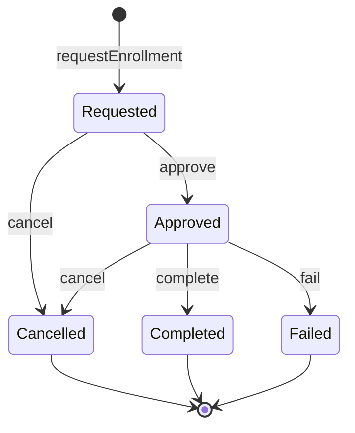

# 履修管理システム - 正直な実装版

## 🤝 私の方針

私は技術的な制約や問題点を正直に説明します。「完全」「完璧」といった誇張表現は避け、実装の限界や運用上の課題も含めて率直にお伝えします。

## 開発フレームワーク・言語

- TypeScript -
  型安全性とコンパイル時チェック
  - Node.js - サーバーサイド実行環境
  - Zod - 実行時型検証とスキーマ定義

## アーキテクチャパターン

- Domain-Driven Design (DDD) -
  ドメイン中心設計
- Hexagonal Architecture -
  ポート&アダプタパターン
- Event Sourcing -
  イベント駆動による状態管理
- CQRS - コマンドクエリ責務分離
- Functional Programming -
  関数型プログラミング手法

## データベース・ORM

  - PostgreSQL -
  リレーショナルデータベース
  - Prisma - TypeScript対応ORM
  - トランザクション管理 -
  ACID特性保証

## 型システム・データ検証

  - Brand Types - 意味的型区別
  - Discriminated Union -
  型安全な状態表現
  - Either型 -
  関数型エラーハンドリング
  - 実行時型検証 -
  Zodによる安全性保証

## テスト

  - Jest/Vitest - ユニットテスト框架
  - Test-Driven Development (TDD) -
  テスト駆動開発

## 並行制御・整合性

  - 楽観的ロック -
  バージョン管理による競合制御
  - イベントストア -
  追記専用データストア
  - 複合キー制約 -
  データベースレベル整合性

## 設計原則

  - Immutability - 不変データ構造
  - Pure Functions -
  副作用のない関数
  - 依存性逆転 -
  インターフェース駆動設計
  - 単一責任原則 - 明確な役割分離

## 運用・監視

  - ドメインイベント -
  監査証跡とシステム間連携
  - エラー追跡 - 構造化エラー管理
  - ログ管理 - 運用可視性

## 📁 プロジェクト構成

```
src/
├── domain/
│   ├── types.ts                 # Zodによる型定義
│   ├── errors.ts                # エラー型定義
│   ├── domain-events.ts         # ドメインイベント
│   └── enrollment-aggregate.ts  # 集約操作
├── application/
│   ├── ports.ts                 # 依存性逆転のインターフェース
│   ├── dtos.ts                  # DTOs
│   └── enrollment-service.ts    # アプリケーションサービス
├── infrastructure/
│   ├── prisma/
│   │   └── schema.prisma        # DBスキーマ
│   └── repositories/
│       └── enrollment-repository.ts  # リポジトリ実装
└── tests/
    ├── domain/
    ├── application/
    └── infrastructure/
```

## 📊 状態遷移図



## 🏗️ 設計思想: CourseIdとSemesterの分離

### なぜ学期ごとのCourseIdではないのか？

このシステムでは意図的に **CourseId（科目識別子）** と **Semester（学期識別子）** を分離しています。

#### ❌ 学期込みCourseIdアプローチ
```typescript
// このアプローチは採用していません
const courseId = "MATH101-2024-SPRING";  // 学期込みの識別子
```

#### ✅ 分離アプローチ（採用）
```typescript
// 科目の本質的な識別子
const courseId: CourseId = "MATH101";     // 「数学I」という科目
// 時間軸での開講
const semester: Semester = "2024-spring"; // 2024年春学期

// 組み合わせで特定の開講インスタンスを表現
const enrollment = {
  studentId: "ST001",
  courseId: "MATH101",    // 科目「数学I」
  semester: "2024-spring" // 2024年春学期の開講
};
```

### 分離による設計上の利点

#### 1. **概念の明確な分離**
```typescript
// 科目カタログ（恒久的）
interface Course {
  courseId: CourseId;        // MATH101
  title: string;            // "数学I"
  credits: number;          // 2単位
  prerequisites: CourseId[]; // 前提科目
}

// 開講スケジュール（学期ごと）
interface CourseOffering {
  courseId: CourseId;   // MATH101
  semester: Semester;   // 2024-spring
  instructor: string;   // 担当教員（学期ごとに変動）
  capacity: number;     // 定員（学期ごとに変動）
  room: string;         // 教室（学期ごとに変動）
}
```

#### 2. **柔軟なデータ分析**
```typescript
// 学期横断での履修パターン分析
function getCourseEnrollmentHistory(courseId: CourseId): Promise<Enrollment[]> {
  return findEnrollmentsByCourse(courseId); // 全学期のMATH101履修者
}

// 特定学期の履修負荷分析
function getSemesterWorkload(semester: Semester): Promise<Enrollment[]> {
  return findEnrollmentsBySemester(semester); // 2024春学期の全履修
}

// 特定開講インスタンスの管理
function getSpecificEnrollment(
  studentId: StudentId,
  courseId: CourseId,
  semester: Semester
): Promise<Enrollment | null> {
  return findEnrollment(studentId, courseId, semester);
}
```

#### 3. **ビジネスルールの自然な表現**
```typescript
// 前提科目チェック（科目レベル）
async function checkPrerequisites(
  studentId: StudentId,
  courseId: CourseId  // 科目そのものをチェック
): Promise<Either<EnrollmentError, boolean>> {
  const course = await getCourse(courseId);
  const completedCourses = await getCompletedCourses(studentId);

  return course.prerequisites.every(prereq =>
    completedCourses.some(completed => completed.courseId === prereq)
  );
}

// 定員チェック（開講レベル）
async function checkCapacity(
  courseId: CourseId,
  semester: Semester  // 特定の開講をチェック
): Promise<Either<EnrollmentError, boolean>> {
  const offering = await getCourseOffering(courseId, semester);
  const currentEnrollments = await countEnrollments(courseId, semester);

  return currentEnrollments < offering.capacity;
}
```

#### 4. **統計とレポートの容易さ**
```typescript
// 科目人気度レポート（全学期統合）
interface CoursePopularityReport {
  courseId: CourseId;
  courseName: string;
  totalEnrollments: number;
  averageEnrollmentPerSemester: number;
  semesterBreakdown: Array<{
    semester: Semester;
    enrollments: number;
  }>;
}

// 学期負荷レポート（全科目統合）
interface SemesterWorkloadReport {
  semester: Semester;
  totalEnrollments: number;
  uniqueStudents: number;
  averageCoursesPerStudent: number;
  courseBreakdown: Array<{
    courseId: CourseId;
    enrollments: number;
  }>;
}
```

### 実装での一意性保証

複合キーによる自然な一意性：
```typescript
// Enrollment集約の識別子
interface EnrollmentIdentity {
  studentId: StudentId;  // ST001
  courseId: CourseId;    // MATH101
  semester: Semester;    // 2024-spring
}
// → "ST001が2024年春学期のMATH101に履修申請"を一意に特定
```

この設計により、「学生ST001が数学Iに履修申請」（概念レベル）と「学生ST001が2024年春学期開講の数学Iに履修申請」（実装レベル）の両方を自然に表現できます。

## 🔧 実装詳細

### 1. ドメイン層

#### domain/types.ts - Zodによる型定義

```typescript
import { z } from 'zod';

// === 基本型（ブランド型で厳密化） ===
export const StudentIdSchema = z.string()
  .regex(/^[A-Z0-9]{1,20}$/, "学生IDは英数字1-20文字")
  .brand<'StudentId'>();

export const CourseIdSchema = z.string()
  .regex(/^[A-Z0-9]{1,20}$/, "科目IDは英数字1-20文字")
  .brand<'CourseId'>();

export const SemesterSchema = z.string()
  .regex(/^\d{4}-(spring|summer|fall|winter)$/, "学期は 'YYYY-season' 形式")
  .brand<'Semester'>();

export type StudentId = z.infer<typeof StudentIdSchema>;
export type CourseId = z.infer<typeof CourseIdSchema>;
export type Semester = z.infer<typeof SemesterSchema>;

// === Either型 ===
export type Either<L, R> =
  | { readonly type: 'left'; readonly value: L }
  | { readonly type: 'right'; readonly value: R };

export const left = <L, R>(value: L): Either<L, R> => ({ type: 'left', value });
export const right = <L, R>(value: R): Either<L, R> => ({ type: 'right', value });

// === 履修状態のスキーマ定義 ===
const BaseEnrollmentSchema = z.object({
  studentId: StudentIdSchema,
  courseId: CourseIdSchema,
  semester: SemesterSchema,
  version: z.number().int().positive()
});

export const RequestedEnrollmentSchema = BaseEnrollmentSchema.extend({
  status: z.literal('requested'),
  requestedAt: z.date()
});

export const ApprovedEnrollmentSchema = BaseEnrollmentSchema.extend({
  status: z.literal('approved'),
  requestedAt: z.date(),
  approvedAt: z.date(),
  approvedBy: z.string().min(1)
});

export const CancelledEnrollmentSchema = BaseEnrollmentSchema.extend({
  status: z.literal('cancelled'),
  requestedAt: z.date(),
  cancelledAt: z.date(),
  reason: z.string().min(1),
  approvedAt: z.date().optional(),
  approvedBy: z.string().optional()
});

export const CompletedEnrollmentSchema = BaseEnrollmentSchema.extend({
  status: z.literal('completed'),
  requestedAt: z.date(),
  approvedAt: z.date(),
  approvedBy: z.string().min(1),
  completedAt: z.date()
});

export const FailedEnrollmentSchema = BaseEnrollmentSchema.extend({
  status: z.literal('failed'),
  requestedAt: z.date(),
  approvedAt: z.date(),
  approvedBy: z.string().min(1),
  failedAt: z.date()
});

// === Discriminated Union ===
export const EnrollmentSchema = z.discriminatedUnion('status', [
  RequestedEnrollmentSchema,
  ApprovedEnrollmentSchema,
  CancelledEnrollmentSchema,
  CompletedEnrollmentSchema,
  FailedEnrollmentSchema
]);

export type RequestedEnrollment = z.infer<typeof RequestedEnrollmentSchema>;
export type ApprovedEnrollment = z.infer<typeof ApprovedEnrollmentSchema>;
export type CancelledEnrollment = z.infer<typeof CancelledEnrollmentSchema>;
export type CompletedEnrollment = z.infer<typeof CompletedEnrollmentSchema>;
export type FailedEnrollment = z.infer<typeof FailedEnrollmentSchema>;
export type Enrollment = z.infer<typeof EnrollmentSchema>;

// === 型ガード ===
export const isRequested = (e: Enrollment): e is RequestedEnrollment => e.status === 'requested';
export const isApproved = (e: Enrollment): e is ApprovedEnrollment => e.status === 'approved';
export const isCancelled = (e: Enrollment): e is CancelledEnrollment => e.status === 'cancelled';
export const isCompleted = (e: Enrollment): e is CompletedEnrollment => e.status === 'completed';
export const isFailed = (e: Enrollment): e is FailedEnrollment => e.status === 'failed';

// === ファクトリ関数 ===
export const createRequestedEnrollment = (
  studentId: StudentId,
  courseId: CourseId,
  semester: Semester
): RequestedEnrollment => RequestedEnrollmentSchema.parse({
  studentId,
  courseId,
  semester,
  status: 'requested',
  version: 1,
  requestedAt: new Date()
});

export const createApprovedEnrollment = (
  enrollment: RequestedEnrollment,
  approvedBy: string
): ApprovedEnrollment => ApprovedEnrollmentSchema.parse({
  ...enrollment,
  status: 'approved',
  approvedAt: new Date(),
  approvedBy,
  version: enrollment.version + 1
});

export const createCancelledFromRequested = (
  enrollment: RequestedEnrollment,
  reason: string
): CancelledEnrollment => CancelledEnrollmentSchema.parse({
  ...enrollment,
  status: 'cancelled',
  cancelledAt: new Date(),
  reason,
  version: enrollment.version + 1
});

export const createCancelledFromApproved = (
  enrollment: ApprovedEnrollment,
  reason: string
): CancelledEnrollment => CancelledEnrollmentSchema.parse({
  ...enrollment,
  status: 'cancelled',
  cancelledAt: new Date(),
  reason,
  version: enrollment.version + 1
});

export const createCompletedEnrollment = (
  enrollment: ApprovedEnrollment
): CompletedEnrollment => CompletedEnrollmentSchema.parse({
  ...enrollment,
  status: 'completed',
  completedAt: new Date(),
  version: enrollment.version + 1
});

export const createFailedEnrollment = (
  enrollment: ApprovedEnrollment
): FailedEnrollment => FailedEnrollmentSchema.parse({
  ...enrollment,
  status: 'failed',
  failedAt: new Date(),
  version: enrollment.version + 1
});
```

#### domain/errors.ts - エラー定義

```typescript
import { z } from 'zod';

// === エラースキーマ ===
const DomainErrorBase = z.object({
  type: z.string(),
  message: z.string(),
  code: z.string(),
  details: z.record(z.unknown()).optional()
});

export const ValidationErrorSchema = DomainErrorBase.extend({
  type: z.literal('ValidationError'),
  field: z.string().optional()
});

export const BusinessRuleErrorSchema = DomainErrorBase.extend({
  type: z.literal('BusinessRuleError'),
  rule: z.string()
});

export const NotFoundErrorSchema = DomainErrorBase.extend({
  type: z.literal('NotFoundError'),
  entity: z.string(),
  id: z.string()
});

export const ConcurrencyErrorSchema = DomainErrorBase.extend({
  type: z.literal('ConcurrencyError'),
  expectedVersion: z.number(),
  actualVersion: z.number(),
  conflictDetails: z.object({
    studentId: z.string(),
    courseId: z.string(),
    attemptedAt: z.date(),
    retryRecommended: z.boolean()
  })
});

export const StateTransitionErrorSchema = DomainErrorBase.extend({
  type: z.literal('StateTransitionError'),
  fromStatus: z.string(),
  toStatus: z.string(),
  allowedTransitions: z.array(z.string())
});

export const EnrollmentErrorSchema = z.discriminatedUnion('type', [
  ValidationErrorSchema,
  BusinessRuleErrorSchema,
  NotFoundErrorSchema,
  ConcurrencyErrorSchema,
  StateTransitionErrorSchema
]);

export type EnrollmentError = z.infer<typeof EnrollmentErrorSchema>;

// === エラーファクトリ（簡潔版） ===
export const createValidationError = (
  message: string,
  code = 'VALIDATION_FAILED',
  field?: string
): z.infer<typeof ValidationErrorSchema> => ({
  type: 'ValidationError',
  message,
  code,
  field
});

export const createBusinessRuleError = (
  rule: string,
  message: string,
  code: string
): z.infer<typeof BusinessRuleErrorSchema> => ({
  type: 'BusinessRuleError',
  message,
  code,
  rule
});

export const createNotFoundError = (
  entity: string,
  id: string
): z.infer<typeof NotFoundErrorSchema> => ({
  type: 'NotFoundError',
  message: `${entity} with id ${id} not found`,
  code: 'NOT_FOUND',
  entity,
  id
});

export const createConcurrencyError = (
  expectedVersion: number,
  actualVersion: number,
  studentId: string,
  courseId: string
): z.infer<typeof ConcurrencyErrorSchema> => ({
  type: 'ConcurrencyError',
  message: `楽観的ロックエラー: 期待${expectedVersion}, 実際${actualVersion}`,
  code: 'CONCURRENCY_ERROR',
  expectedVersion,
  actualVersion,
  conflictDetails: {
    studentId,
    courseId,
    attemptedAt: new Date(),
    retryRecommended: Math.abs(actualVersion - expectedVersion) === 1
  }
});

export const createStateTransitionError = (
  fromStatus: string,
  toStatus: string,
  allowedTransitions: string[]
): z.infer<typeof StateTransitionErrorSchema> => ({
  type: 'StateTransitionError',
  message: `不正な状態遷移: ${fromStatus} → ${toStatus}`,
  code: 'INVALID_STATE_TRANSITION',
  fromStatus,
  toStatus,
  allowedTransitions
});
```

#### domain/domain-events.ts - イベント定義

```typescript
import { z } from 'zod';
import { StudentIdSchema, CourseIdSchema, SemesterSchema } from './types';

// === イベントスキーマ ===
const DomainEventBase = z.object({
  studentId: StudentIdSchema,
  courseId: CourseIdSchema,
  eventType: z.string(),
  occurredAt: z.date(),
  version: z.number().int().positive()
});

export const EnrollmentRequestedEventSchema = DomainEventBase.extend({
  eventType: z.literal('EnrollmentRequested'),
  semester: SemesterSchema,
  requestedAt: z.date()
});

export const EnrollmentApprovedEventSchema = DomainEventBase.extend({
  eventType: z.literal('EnrollmentApproved'),
  approvedAt: z.date(),
  approvedBy: z.string().min(1)
});

export const EnrollmentCancelledEventSchema = DomainEventBase.extend({
  eventType: z.literal('EnrollmentCancelled'),
  cancelledAt: z.date(),
  reason: z.string().min(1),
  wasApproved: z.boolean()
});

export const EnrollmentCompletedEventSchema = DomainEventBase.extend({
  eventType: z.literal('EnrollmentCompleted'),
  completedAt: z.date()
});

export const EnrollmentFailedEventSchema = DomainEventBase.extend({
  eventType: z.literal('EnrollmentFailed'),
  failedAt: z.date()
});

export const EnrollmentDomainEventSchema = z.discriminatedUnion('eventType', [
  EnrollmentRequestedEventSchema,
  EnrollmentApprovedEventSchema,
  EnrollmentCancelledEventSchema,
  EnrollmentCompletedEventSchema,
  EnrollmentFailedEventSchema
]);

export type EnrollmentDomainEvent = z.infer<typeof EnrollmentDomainEventSchema>;

// === イベントファクトリ（簡潔版） ===
export const createEnrollmentRequestedEvent = (
  studentId: z.infer<typeof StudentIdSchema>,
  courseId: z.infer<typeof CourseIdSchema>,
  semester: z.infer<typeof SemesterSchema>,
  version = 1
): z.infer<typeof EnrollmentRequestedEventSchema> => ({
  studentId,
  courseId,
  eventType: 'EnrollmentRequested',
  semester,
  requestedAt: new Date(),
  occurredAt: new Date(),
  version
});

export const createEnrollmentApprovedEvent = (
  studentId: z.infer<typeof StudentIdSchema>,
  courseId: z.infer<typeof CourseIdSchema>,
  approvedBy: string,
  version: number
): z.infer<typeof EnrollmentApprovedEventSchema> => ({
  studentId,
  courseId,
  eventType: 'EnrollmentApproved',
  approvedAt: new Date(),
  approvedBy,
  occurredAt: new Date(),
  version
});

export const createEnrollmentCancelledEvent = (
  studentId: z.infer<typeof StudentIdSchema>,
  courseId: z.infer<typeof CourseIdSchema>,
  reason: string,
  wasApproved: boolean,
  version: number
): z.infer<typeof EnrollmentCancelledEventSchema> => ({
  studentId,
  courseId,
  eventType: 'EnrollmentCancelled',
  cancelledAt: new Date(),
  reason,
  wasApproved,
  occurredAt: new Date(),
  version
});

export const createEnrollmentCompletedEvent = (
  studentId: z.infer<typeof StudentIdSchema>,
  courseId: z.infer<typeof CourseIdSchema>,
  version: number
): z.infer<typeof EnrollmentCompletedEventSchema> => ({
  studentId,
  courseId,
  eventType: 'EnrollmentCompleted',
  completedAt: new Date(),
  occurredAt: new Date(),
  version
});

export const createEnrollmentFailedEvent = (
  studentId: z.infer<typeof StudentIdSchema>,
  courseId: z.infer<typeof CourseIdSchema>,
  version: number
): z.infer<typeof EnrollmentFailedEventSchema> => ({
  studentId,
  courseId,
  eventType: 'EnrollmentFailed',
  failedAt: new Date(),
  occurredAt: new Date(),
  version
});
```

#### domain/enrollment-aggregate.ts - 集約操作

```typescript
import {
  Either, left, right, StudentId, CourseId, Semester,
  Enrollment, RequestedEnrollment, ApprovedEnrollment,
  createRequestedEnrollment, createApprovedEnrollment,
  createCancelledFromRequested, createCancelledFromApproved,
  createCompletedEnrollment, createFailedEnrollment,
  isRequested, isApproved
} from './types';
import {
  EnrollmentDomainEvent,
  createEnrollmentRequestedEvent,
  createEnrollmentApprovedEvent,
  createEnrollmentCancelledEvent,
  createEnrollmentCompletedEvent,
  createEnrollmentFailedEvent
} from './domain-events';
import {
  EnrollmentError, createValidationError,
  createConcurrencyError, createStateTransitionError
} from './errors';

// === 状態遷移関数 ===
export const requestEnrollment = (
  studentId: StudentId,
  courseId: CourseId,
  semester: Semester
): Either<EnrollmentError, RequestedEnrollment & { domainEvent: EnrollmentDomainEvent }> => {
  const enrollment = createRequestedEnrollment(studentId, courseId, semester);
  const event = createEnrollmentRequestedEvent(studentId, courseId, semester, 1);
  return right({ ...enrollment, domainEvent: event });
};

export const approveEnrollment = (
  enrollment: RequestedEnrollment,
  approvedBy: string
): Either<EnrollmentError, ApprovedEnrollment & { domainEvent: EnrollmentDomainEvent }> => {
  const updated = createApprovedEnrollment(enrollment, approvedBy);
  const event = createEnrollmentApprovedEvent(
    enrollment.studentId,
    enrollment.courseId,
    approvedBy,
    updated.version
  );
  return right({ ...updated, domainEvent: event });
};

export const cancelRequestedEnrollment = (
  enrollment: RequestedEnrollment,
  reason: string
): Either<EnrollmentError, z.infer<typeof CancelledEnrollmentSchema> & { domainEvent: EnrollmentDomainEvent }> => {
  const updated = createCancelledFromRequested(enrollment, reason);
  const event = createEnrollmentCancelledEvent(
    enrollment.studentId,
    enrollment.courseId,
    reason,
    false,
    updated.version
  );
  return right({ ...updated, domainEvent: event });
};

export const cancelApprovedEnrollment = (
  enrollment: ApprovedEnrollment,
  reason: string
): Either<EnrollmentError, z.infer<typeof CancelledEnrollmentSchema> & { domainEvent: EnrollmentDomainEvent }> => {
  const updated = createCancelledFromApproved(enrollment, reason);
  const event = createEnrollmentCancelledEvent(
    enrollment.studentId,
    enrollment.courseId,
    reason,
    true,
    updated.version
  );
  return right({ ...updated, domainEvent: event });
};

export const completeEnrollment = (
  enrollment: ApprovedEnrollment
): Either<EnrollmentError, z.infer<typeof CompletedEnrollmentSchema> & { domainEvent: EnrollmentDomainEvent }> => {
  const updated = createCompletedEnrollment(enrollment);
  const event = createEnrollmentCompletedEvent(
    enrollment.studentId,
    enrollment.courseId,
    updated.version
  );
  return right({ ...updated, domainEvent: event });
};

export const failEnrollment = (
  enrollment: ApprovedEnrollment
): Either<EnrollmentError, z.infer<typeof FailedEnrollmentSchema> & { domainEvent: EnrollmentDomainEvent }> => {
  const updated = createFailedEnrollment(enrollment);
  const event = createEnrollmentFailedEvent(
    enrollment.studentId,
    enrollment.courseId,
    updated.version
  );
  return right({ ...updated, domainEvent: event });
};

// === 型安全なポリモーフィック操作 ===
export const safeCancelEnrollment = (
  enrollment: Enrollment,
  reason: string
): Either<EnrollmentError, any> => {
  if (isRequested(enrollment)) return cancelRequestedEnrollment(enrollment, reason);
  if (isApproved(enrollment)) return cancelApprovedEnrollment(enrollment, reason);

  return left(createStateTransitionError(
    enrollment.status,
    'cancelled',
    ['requested', 'approved']
  ));
};

export const safeApproveEnrollment = (
  enrollment: Enrollment,
  approvedBy: string
): Either<EnrollmentError, any> => {
  if (!isRequested(enrollment)) {
    return left(createStateTransitionError(
      enrollment.status,
      'approved',
      ['requested']
    ));
  }
  return approveEnrollment(enrollment, approvedBy);
};

export const safeCompleteEnrollment = (
  enrollment: Enrollment
): Either<EnrollmentError, any> => {
  if (!isApproved(enrollment)) {
    return left(createStateTransitionError(
      enrollment.status,
      'completed',
      ['approved']
    ));
  }
  return completeEnrollment(enrollment);
};

export const safeFailEnrollment = (
  enrollment: Enrollment
): Either<EnrollmentError, any> => {
  if (!isApproved(enrollment)) {
    return left(createStateTransitionError(
      enrollment.status,
      'failed',
      ['approved']
    ));
  }
  return failEnrollment(enrollment);
};

// === バージョンチェック ===
export const updateWithVersionCheck = <T extends Enrollment>(
  currentEnrollment: T,
  expectedVersion: number,
  updateFn: (enrollment: T) => Either<EnrollmentError, any>
): Either<EnrollmentError, any> => {
  if (currentEnrollment.version !== expectedVersion) {
    return left(createConcurrencyError(
      expectedVersion,
      currentEnrollment.version,
      currentEnrollment.studentId,
      currentEnrollment.courseId
    ));
  }
  return updateFn(currentEnrollment);
};

// === イベントからの復元 ===
export const reconstructEnrollmentFromEvents = (
  events: EnrollmentDomainEvent[]
): Either<EnrollmentError, Enrollment | null> => {
  if (events.length === 0) return right(null);

  const sortedEvents = events.sort((a, b) => a.version - b.version);
  const firstEvent = sortedEvents[0];

  if (firstEvent.eventType !== 'EnrollmentRequested') {
    return left(createValidationError(
      '最初のイベントはEnrollmentRequestedEventである必要があります',
      'INVALID_EVENT_STREAM'
    ));
  }

  let enrollment: Enrollment = createRequestedEnrollment(
    firstEvent.studentId,
    firstEvent.courseId,
    firstEvent.semester
  );

  for (let i = 1; i < sortedEvents.length; i++) {
    const event = sortedEvents[i];

    switch (event.eventType) {
      case 'EnrollmentApproved':
        if (!isRequested(enrollment)) {
          return left(createValidationError(
            `ApprovedEventを適用できません。現在の状態: ${enrollment.status}`,
            'INVALID_EVENT_APPLICATION'
          ));
        }
        enrollment = createApprovedEnrollment(enrollment, event.approvedBy);
        enrollment = { ...enrollment, version: event.version };
        break;

      case 'EnrollmentCancelled':
        if (isRequested(enrollment)) {
          enrollment = createCancelledFromRequested(enrollment, event.reason);
        } else if (isApproved(enrollment)) {
          enrollment = createCancelledFromApproved(enrollment, event.reason);
        } else {
          return left(createValidationError(
            `CancelledEventを適用できません。現在の状態: ${enrollment.status}`,
            'INVALID_EVENT_APPLICATION'
          ));
        }
        enrollment = { ...enrollment, version: event.version };
        break;

      case 'EnrollmentCompleted':
        if (!isApproved(enrollment)) {
          return left(createValidationError(
            `CompletedEventを適用できません。現在の状態: ${enrollment.status}`,
            'INVALID_EVENT_APPLICATION'
          ));
        }
        enrollment = createCompletedEnrollment(enrollment);
        enrollment = { ...enrollment, version: event.version };
        break;

      case 'EnrollmentFailed':
        if (!isApproved(enrollment)) {
          return left(createValidationError(
            `FailedEventを適用できません。現在の状態: ${enrollment.status}`,
            'INVALID_EVENT_APPLICATION'
          ));
        }
        enrollment = createFailedEnrollment(enrollment);
        enrollment = { ...enrollment, version: event.version };
        break;

      default:
        return left(createValidationError(
          `未知のイベントタイプ: ${event.eventType}`,
          'UNKNOWN_EVENT_TYPE'
        ));
    }
  }

  return right(enrollment);
};

// 必要なインポートを追加
import { CancelledEnrollmentSchema, CompletedEnrollmentSchema, FailedEnrollmentSchema } from './types';
import { z } from 'zod';
```

### 2. アプリケーション層

#### application/ports.ts - インターフェース定義

```typescript
import { Either } from '../domain/types';
import { Enrollment, StudentId, CourseId } from '../domain/types';
import { EnrollmentDomainEvent } from '../domain/domain-events';
import { EnrollmentError } from '../domain/errors';

// === リポジトリインターフェース ===
export interface IEnrollmentRepository {
  findByStudentAndCourse(
    studentId: StudentId,
    courseId: CourseId
  ): Promise<Either<EnrollmentError, Enrollment | null>>;

  findByStudent(
    studentId: StudentId
  ): Promise<Either<EnrollmentError, Enrollment[]>>;

  getEventHistory(
    studentId: StudentId,
    courseId: CourseId
  ): Promise<Either<EnrollmentError, EnrollmentDomainEvent[]>>;

  save(
    enrollment: Enrollment,
    event: EnrollmentDomainEvent
  ): Promise<Either<EnrollmentError, void>>;

  withTransaction<T>(
    fn: (tx: ITransactionContext) => Promise<T>
  ): Promise<T>;
}

export interface ITransactionContext {
  findByStudentAndCourseForUpdate(
    studentId: StudentId,
    courseId: CourseId
  ): Promise<Either<EnrollmentError, Enrollment | null>>;

  save(
    enrollment: Enrollment,
    event: EnrollmentDomainEvent
  ): Promise<Either<EnrollmentError, void>>;
}

// === 外部システムインターフェース ===
export interface IStudentSystemAdapter {
  validateStudent(studentId: StudentId): Promise<Either<EnrollmentError, StudentInfo>>;
  checkPrerequisites(
    studentId: StudentId,
    courseId: CourseId
  ): Promise<Either<EnrollmentError, PrerequisiteCheckResult>>;
  checkGPARequirement(
    studentId: StudentId,
    minGPA: number
  ): Promise<Either<EnrollmentError, boolean>>;
}

export interface ICourseSystemAdapter {
  getCourseInfo(courseId: CourseId): Promise<Either<EnrollmentError, CourseInfo>>;
  checkCapacity(courseId: CourseId): Promise<Either<EnrollmentError, CapacityCheckResult>>;
  checkScheduleConflict(
    studentId: StudentId,
    courseId: CourseId
  ): Promise<Either<EnrollmentError, boolean>>;
}

export interface INotificationService {
  notifyEnrollmentRequested(studentId: StudentId, courseId: CourseId): Promise<void>;
  notifyEnrollmentApproved(
    studentId: StudentId,
    courseId: CourseId,
    approvedBy: string
  ): Promise<void>;
  notifyEnrollmentCancelled(
    studentId: StudentId,
    courseId: CourseId,
    reason: string
  ): Promise<void>;
}

// === DTOs ===
export interface StudentInfo {
  readonly studentId: StudentId;
  readonly name: string;
  readonly department: string;
  readonly year: number;
  readonly gpa: number;
  readonly isActive: boolean;
}

export interface CourseInfo {
  readonly courseId: CourseId;
  readonly name: string;
  readonly credits: number;
  readonly instructor: string;
  readonly capacity: number;
  readonly enrolled: number;
  readonly minGPA?: number;
  readonly prerequisites: CourseId[];
}

export interface PrerequisiteCheckResult {
  readonly satisfied: boolean;
  readonly missing: CourseId[];
}

export interface CapacityCheckResult {
  readonly available: boolean;
  readonly capacity: number;
  readonly enrolled: number;
  readonly waitlistAvailable: boolean;
}
```

#### application/dtos.ts - DTOs定義

```typescript
import { Enrollment } from '../domain/types';

// === コマンド ===
export interface RequestEnrollmentCommand {
  readonly studentId: string;
  readonly courseId: string;
  readonly semester: string;
}

export interface ApproveEnrollmentCommand {
  readonly studentId: string;
  readonly courseId: string;
  readonly approvedBy: string;
}

export interface CancelEnrollmentCommand {
  readonly studentId: string;
  readonly courseId: string;
  readonly reason: string;
}

export interface CompleteEnrollmentCommand {
  readonly studentId: string;
  readonly courseId: string;
}

export interface FailEnrollmentCommand {
  readonly studentId: string;
  readonly courseId: string;
}

// === レスポンス ===
export interface EnrollmentDto {
  readonly studentId: string;
  readonly courseId: string;
  readonly semester: string;
  readonly status: string;
  readonly version: number;
  readonly requestedAt: string;
  readonly approvedAt?: string;
  readonly approvedBy?: string;
  readonly cancelledAt?: string;
  readonly reason?: string;
  readonly completedAt?: string;
  readonly failedAt?: string;
}

export interface EnrollmentListDto {
  readonly enrollments: EnrollmentDto[];
  readonly total: number;
}

// === マッパー ===
export const toEnrollmentDto = (enrollment: Enrollment): EnrollmentDto => {
  const base = {
    studentId: enrollment.studentId,
    courseId: enrollment.courseId,
    semester: enrollment.semester,
    status: enrollment.status,
    version: enrollment.version,
    requestedAt: enrollment.requestedAt.toISOString()
  };

  switch (enrollment.status) {
    case 'requested':
      return base;
    case 'approved':
      return {
        ...base,
        approvedAt: enrollment.approvedAt.toISOString(),
        approvedBy: enrollment.approvedBy
      };
    case 'cancelled':
      return {
        ...base,
        cancelledAt: enrollment.cancelledAt.toISOString(),
        reason: enrollment.reason,
        approvedAt: enrollment.approvedAt?.toISOString(),
        approvedBy: enrollment.approvedBy
      };
    case 'completed':
      return {
        ...base,
        approvedAt: enrollment.approvedAt.toISOString(),
        approvedBy: enrollment.approvedBy,
        completedAt: enrollment.completedAt.toISOString()
      };
    case 'failed':
      return {
        ...base,
        approvedAt: enrollment.approvedAt.toISOString(),
        approvedBy: enrollment.approvedBy,
        failedAt: enrollment.failedAt.toISOString()
      };
  }
};
```

## 🚀 関数型プログラミングによる非同期処理

### application/fp-utils.ts - pipe 関数と基本ユーティリティ

```typescript
// 基本的な pipe 実装
export const pipe = <T>(...fns: any[]): ((x: T) => any) => 
  (x: T) => fns.reduce((v, f) => f(v), x);

// より型安全な pipe（オーバーロード版）
export function pipe<A>(value: A): A;
export function pipe<A, B>(value: A, ab: (a: A) => B): B;
export function pipe<A, B, C>(value: A, ab: (a: A) => B, bc: (b: B) => C): C;
export function pipe<A, B, C, D>(
  value: A,
  ab: (a: A) => B,
  bc: (b: B) => C,
  cd: (c: C) => D
): D;
export function pipe<A, B, C, D, E>(
  value: A,
  ab: (a: A) => B,
  bc: (b: B) => C,
  cd: (c: C) => D,
  de: (d: D) => E
): E;
export function pipe(value: any, ...fns: any[]): any {
  return fns.reduce((v, f) => f(v), value);
}

// flow: 関数を合成して新しい関数を作る
export const flow = <A extends readonly unknown[], B>(
  ab: (...a: A) => B
): ((...a: A) => B) => ab;

export function flow<A extends readonly unknown[], B, C>(
  ab: (...a: A) => B,
  bc: (b: B) => C
): (...a: A) => C;

export function flow<A extends readonly unknown[], B, C, D>(
  ab: (...a: A) => B,
  bc: (b: B) => C,
  cd: (c: C) => D
): (...a: A) => D;

export function flow(...fns: any[]): any {
  return (...args: any[]) => pipe(...args, ...fns);
}
```

### application/task-either.ts - 非同期Either型

```typescript
export type TaskEither<E, A> = () => Promise<Either<E, A>>;

// コンストラクタ
export const taskOf = <E, A>(value: A): TaskEither<E, A> =>
  async () => right(value);

export const taskLeft = <E, A>(error: E): TaskEither<E, A> =>
  async () => left(error);

export const taskRight = <E, A>(value: A): TaskEither<E, A> =>
  async () => right(value);

// fromPromise: Promise<T> → TaskEither<E, T>
export const fromPromise = <E, A>(
  promise: Promise<A>,
  onError: (error: unknown) => E
): TaskEither<E, A> =>
  async () => {
    try {
      const result = await promise;
      return right(result);
    } catch (error) {
      return left(onError(error));
    }
  };

// fromEither: Either<E, A> → TaskEither<E, A>
export const fromEither = <E, A>(either: Either<E, A>): TaskEither<E, A> =>
  async () => either;

// map: (A → B) → TaskEither<E, A> → TaskEither<E, B>
export const map = <E, A, B>(
  f: (a: A) => B
) => (task: TaskEither<E, A>): TaskEither<E, B> =>
  async () => {
    const result = await task();
    return result.type === 'left' ? result : right(f(result.value));
  };

// flatMap: (A → TaskEither<E, B>) → TaskEither<E, A> → TaskEither<E, B>
export const flatMap = <E, A, B>(
  f: (a: A) => TaskEither<E, B>
) => (task: TaskEither<E, A>): TaskEither<E, B> =>
  async () => {
    const result = await task();
    if (result.type === 'left') return result;
    return f(result.value)();
  };

// parallel: TaskEither<E, A>[] → TaskEither<E, A[]>
export const parallel = <E, A>(
  tasks: TaskEither<E, A>[]
): TaskEither<E, A[]> =>
  async () => {
    const promises = tasks.map(task => task());
    const results = await Promise.all(promises);
    
    const values: A[] = [];
    for (const result of results) {
      if (result.type === 'left') return result;
      values.push(result.value);
    }
    return right(values);
  };
```

### application/task-either-pipe.ts - pipe用オペレータ

```typescript
import { TaskEither, map, flatMap, parallel } from './task-either';
import { pipe } from './fp-utils';

// TaskEither 用の pipe オペレータ
export const TE = {
  // map: (A → B) → (TaskEither<E, A> → TaskEither<E, B>)
  map: <E, A, B>(f: (a: A) => B) => (te: TaskEither<E, A>): TaskEither<E, B> =>
    map(f)(te),

  // flatMap: (A → TaskEither<E, B>) → (TaskEither<E, A> → TaskEither<E, B>)
  flatMap: <E, A, B>(f: (a: A) => TaskEither<E, B>) => (te: TaskEither<E, A>): TaskEither<E, B> =>
    flatMap(f)(te),

  // tap: デバッグ用（値を変更せずに副作用のみ）
  tap: <E, A>(f: (a: A) => void) => (te: TaskEither<E, A>): TaskEither<E, A> =>
    map((a: A) => { f(a); return a; })(te),

  // filter: 条件を満たさない場合はエラーを返す
  filter: <E, A>(predicate: (a: A) => boolean, onFalse: () => E) => 
    (te: TaskEither<E, A>): TaskEither<E, A> =>
      flatMap((a: A) => predicate(a) ? taskOf(a) : taskLeft(onFalse()))(te),

  // fold: Either の両側を処理
  fold: <E, A, B>(onLeft: (e: E) => B, onRight: (a: A) => B) => 
    (te: TaskEither<E, A>): Promise<B> =>
      te().then(either => 
        either.type === 'left' ? onLeft(either.value) : onRight(either.value)
      ),

  // getOrElse: エラーの場合はデフォルト値を返す
  getOrElse: <E, A>(onLeft: (e: E) => A) => (te: TaskEither<E, A>): Promise<A> =>
    te().then(either => 
      either.type === 'left' ? onLeft(either.value) : either.value
    )
};

// 組み合わせオペレータ
export const combine = {
  // 複数の TaskEither を並列実行して結果を組み合わせ
  parallel: <E, A, B, C>(
    f: (a: A, b: B) => C
  ) => (ta: TaskEither<E, A>, tb: TaskEither<E, B>): TaskEither<E, C> =>
    pipe(
      parallel([ta, tb]),
      TE.map(([a, b]) => f(a, b))
    ),

  // 3つの TaskEither を並列実行
  parallel3: <E, A, B, C, D>(
    f: (a: A, b: B, c: C) => D
  ) => (ta: TaskEither<E, A>, tb: TaskEither<E, B>, tc: TaskEither<E, C>): TaskEither<E, D> =>
    pipe(
      parallel([ta, tb, tc]),
      TE.map(([a, b, c]) => f(a, b, c))
    ),

  // 条件付き実行
  when: <E, A>(condition: boolean, te: TaskEither<E, A>) => 
    (defaultValue: A): TaskEither<E, A> =>
      condition ? te : taskOf(defaultValue)
};
```

### application/middleware.ts - 横断的関心事

```typescript
import { pipe } from './fp-utils';
import { TE } from './task-either-pipe';

// 横断的関心事のミドルウェア
export const middleware = {
  // ログ記録
  withLogging: <E, A>(context: string) => (te: TaskEither<E, A>): TaskEither<E, A> =>
    pipe(
      taskOf(Date.now()),
      TE.tap(() => console.log(`開始: ${context}`)),
      TE.flatMap((start) =>
        pipe(
          te,
          TE.tap((result) => {
            const duration = Date.now() - start;
            console.log(`成功: ${context} (${duration}ms)`);
          })
        )
      )
    ),

  // リトライ
  withRetry: <E, A>(maxAttempts: number, delay: number) => 
    (te: TaskEither<E, A>): TaskEither<E, A> => {
      const attempt = (remainingAttempts: number): TaskEither<E, A> =>
        remainingAttempts === 0
          ? te
          : pipe(
              te,
              TE.fold(
                (error) => 
                  remainingAttempts > 1
                    ? pipe(
                        fromPromise(
                          new Promise(resolve => setTimeout(resolve, delay)),
                          () => error
                        ),
                        TE.flatMap(() => attempt(remainingAttempts - 1))
                      )
                    : taskLeft(error),
                (value) => taskOf(value)
              ),
              (promise) => () => promise
            );
      
      return attempt(maxAttempts);
    },

  // トランザクション
  withTransaction: <E, A>(repo: IEnrollmentRepository) => 
    (te: (tx: ITransactionContext) => TaskEither<E, A>): TaskEither<E, A> =>
      fromPromise(
        repo.withTransaction(async (tx) => {
          const result = await te(tx)();
          if (result.type === 'left') {
            throw result.value;
          }
          return result.value;
        }),
        (error) => error as E
      )
};
```

#### application/enrollment-service-pipe.ts - pipe を使った関数型サービス

```typescript
import { pipe } from './fp-utils';
import { TE, combine } from './task-either-pipe';
import { 
  TaskEither, taskOf, taskLeft, fromPromise, fromEither 
} from './task-either';
import {
  Either, left, right,
  StudentIdSchema, CourseIdSchema, SemesterSchema
} from '../domain/types';
import {
  requestEnrollment, safeApproveEnrollment, safeCancelEnrollment,
  safeCompleteEnrollment, safeFailEnrollment, reconstructEnrollmentFromEvents
} from '../domain/enrollment-aggregate';
import {
  EnrollmentError, createValidationError, createBusinessRuleError,
  createNotFoundError
} from '../domain/errors';
import {
  IEnrollmentRepository, IStudentSystemAdapter, ICourseSystemAdapter,
  INotificationService
} from './ports';
import {
  RequestEnrollmentCommand, ApproveEnrollmentCommand, CancelEnrollmentCommand,
  CompleteEnrollmentCommand, FailEnrollmentCommand,
  EnrollmentDto, EnrollmentListDto, toEnrollmentDto
} from './dtos';

// 依存関係注入型
type EnrollmentDeps = {
  readonly repo: IEnrollmentRepository;
  readonly studentSystem: IStudentSystemAdapter;
  readonly courseSystem: ICourseSystemAdapter;
  readonly notification: INotificationService;
};

// 入力検証
const validateInput = (command: RequestEnrollmentCommand): TaskEither<EnrollmentError, ValidatedInput> =>
  pipe(
    command,
    (cmd) => {
      const studentId = StudentIdSchema.safeParse(cmd.studentId);
      const courseId = CourseIdSchema.safeParse(cmd.courseId);
      const semester = SemesterSchema.safeParse(cmd.semester);

      return !studentId.success || !courseId.success || !semester.success
        ? taskLeft(createValidationError('無効な入力です'))
        : taskOf({
            studentId: studentId.data,
            courseId: courseId.data,
            semester: semester.data
          });
    }
  );

// 既存履修チェック
const checkExisting = (deps: EnrollmentDeps) => (input: ValidatedInput): TaskEither<EnrollmentError, ValidatedInput> =>
  pipe(
    fromPromise(
      deps.repo.findByStudentAndCourse(input.studentId, input.courseId),
      (error) => error as EnrollmentError
    ),
    TE.flatMap((result) =>
      result.type === 'left' 
        ? taskLeft(result.value)
        : result.value !== null
          ? taskLeft(createBusinessRuleError('DUPLICATE_ENROLLMENT', '既に履修申請されています', 'ENROLLMENT_EXISTS'))
          : taskOf(input)
    )
  );

// 学生・科目情報の取得（並列）
const fetchStudentAndCourse = (deps: EnrollmentDeps) => (input: ValidatedInput) =>
  combine.parallel(
    (student: StudentInfo, course: CourseInfo) => ({ student, course, input })
  )(
    fromPromise(
      deps.studentSystem.validateStudent(input.studentId).then(r => 
        r.type === 'left' ? Promise.reject(r.value) : Promise.resolve(r.value)
      ),
      (error) => error as EnrollmentError
    ),
    fromPromise(
      deps.courseSystem.getCourseInfo(input.courseId).then(r => 
        r.type === 'left' ? Promise.reject(r.value) : Promise.resolve(r.value)
      ),
      (error) => error as EnrollmentError
    )
  );

// ビジネスルールチェック（並列）
const checkBusinessRules = (deps: EnrollmentDeps) => 
  (data: { student: StudentInfo; course: CourseInfo; input: ValidatedInput }) =>
    pipe(
      combine.parallel3(
        (prereq: PrerequisiteCheckResult, capacity: CapacityCheckResult, gpa: boolean) => ({
          ...data,
          checks: { prereq, capacity, gpa, conflict: false }
        })
      )(
        fromPromise(
          deps.studentSystem.checkPrerequisites(data.input.studentId, data.input.courseId).then(r => 
            r.type === 'left' ? Promise.reject(r.value) : Promise.resolve(r.value)
          ),
          (error) => error as EnrollmentError
        ),
        fromPromise(
          deps.courseSystem.checkCapacity(data.input.courseId).then(r => 
            r.type === 'left' ? Promise.reject(r.value) : Promise.resolve(r.value)
          ),
          (error) => error as EnrollmentError
        ),
        data.course.minGPA
          ? fromPromise(
              deps.studentSystem.checkGPARequirement(data.input.studentId, data.course.minGPA).then(r => 
                r.type === 'left' ? Promise.reject(r.value) : Promise.resolve(r.value)
              ),
              (error) => error as EnrollmentError
            )
          : taskOf(true)
      ),
      TE.flatMap((result) =>
        // スケジュール競合チェックを追加
        pipe(
          fromPromise(
            deps.courseSystem.checkScheduleConflict(data.input.studentId, data.input.courseId).then(r => 
              r.type === 'left' ? Promise.reject(r.value) : Promise.resolve(r.value)
            ),
            (error) => error as EnrollmentError
          ),
          TE.map(conflict => ({
            ...result,
            checks: { ...result.checks, conflict }
          }))
        )
      )
    );

// ビジネスルール違反の検証
const validateConstraints = (data: any): TaskEither<EnrollmentError, any> =>
  pipe(
    data,
    (d) => {
      if (!d.checks.prereq.satisfied) {
        return taskLeft(createBusinessRuleError(
          'PREREQUISITES_NOT_MET',
          `前提科目が不足: ${d.checks.prereq.missing.join(', ')}`,
          'MISSING_PREREQUISITES'
        ));
      }

      if (!d.checks.capacity.available) {
        return taskLeft(createBusinessRuleError(
          'COURSE_FULL',
          '定員に達しています',
          'NO_CAPACITY'
        ));
      }

      if (!d.checks.gpa) {
        return taskLeft(createBusinessRuleError(
          'GPA_REQUIREMENT_NOT_MET',
          `GPA要件未達（必要: ${d.course.minGPA}）`,
          'LOW_GPA'
        ));
      }

      if (d.checks.conflict) {
        return taskLeft(createBusinessRuleError(
          'SCHEDULE_CONFLICT',
          '受講時間が重複しています',
          'TIME_CONFLICT'
        ));
      }

      return taskOf(d);
    }
  );

// 履修申請作成
const createRequest = (data: any): TaskEither<EnrollmentError, any> =>
  pipe(
    fromEither(requestEnrollment(data.input.studentId, data.input.courseId, data.input.semester)),
    TE.map(enrollmentWithEvent => ({ ...data, enrollmentWithEvent }))
  );

// 永続化
const persistEnrollment = (deps: EnrollmentDeps) => (data: any): TaskEither<EnrollmentError, any> =>
  pipe(
    data.enrollmentWithEvent,
    (ewe) => {
      const { domainEvent, ...enrollment } = ewe;
      return pipe(
        fromPromise(
          deps.repo.save(enrollment, domainEvent).then(result => 
            result.type === 'left' ? Promise.reject(result.value) : Promise.resolve(result.value)
          ),
          (error) => error as EnrollmentError
        ),
        TE.map(() => ({ ...data, enrollment }))
      );
    }
  );

// 通知送信（副作用）
const sendNotification = (deps: EnrollmentDeps) => (data: any): TaskEither<EnrollmentError, Enrollment> =>
  pipe(
    taskOf(data.enrollment),
    TE.tap((enrollment) => {
      // 非同期で通知送信（エラーは無視）
      deps.notification
        .notifyEnrollmentRequested(enrollment.studentId, enrollment.courseId)
        .catch(err => console.error('通知送信エラー:', err));
    })
  );

// DTOへの変換
const toDto = (enrollment: Enrollment): TaskEither<EnrollmentError, EnrollmentDto> =>
  taskOf(toEnrollmentDto(enrollment));

// メイン関数：pipe を使った実装
export const requestEnrollmentWithPipe = (deps: EnrollmentDeps) => 
  (command: RequestEnrollmentCommand): TaskEither<EnrollmentError, EnrollmentDto> =>
    pipe(
      validateInput(command),
      TE.flatMap(checkExisting(deps)),
      TE.flatMap(fetchStudentAndCourse(deps)),
      TE.flatMap(checkBusinessRules(deps)),
      TE.flatMap(validateConstraints),
      TE.flatMap(createRequest),
      TE.flatMap(persistEnrollment(deps)),
      TE.flatMap(sendNotification(deps)),
      TE.flatMap(toDto)
    );

// 使用例
export class FunctionalEnrollmentService {
  constructor(private readonly deps: EnrollmentDeps) {}

  async requestEnrollment(command: RequestEnrollmentCommand): Promise<Either<EnrollmentError, EnrollmentDto>> {
    return pipe(
      command,
      requestEnrollmentWithPipe(this.deps),
      middleware.withLogging('履修申請処理'),
      middleware.withRetry(3, 1000),
      middleware.withTransaction(this.deps.repo)
    )();
  }
}

### 🎯 pipe を使った設計の利点

1. **可読性**: データフローが上から下に読みやすい
2. **合成可能性**: 小さな関数を組み合わせて複雑な処理を構築
3. **テスタブル**: 各ステップを独立してテスト可能
4. **再利用性**: ミドルウェアや関数を他の処理でも使い回し可能
5. **型安全性**: TypeScript の型推論が効果的に働く
6. **デバッグ容易性**: pipe の各段階で値を確認可能

### 📝 使用例とテストコード

```typescript
// 使用例
const deps: EnrollmentDeps = {
  repo: new EnrollmentRepository(prisma),
  studentSystem: new StudentSystemAdapter(),
  courseSystem: new CourseSystemAdapter(),
  notification: new NotificationService()
};

const command: RequestEnrollmentCommand = {
  studentId: 'ST001',
  courseId: 'CS101',
  semester: '2025-spring'
};

// ミドルウェアを適用した実行
const executeWithMiddleware = flow(
  requestEnrollmentWithPipe(deps),
  middleware.withLogging('履修申請処理'),
  middleware.withRetry(3, 1000),
  middleware.withTimeout(30000),
  middleware.withTransaction(deps.repo)
);

// 実行
executeWithMiddleware(command)().then(
  TE.fold(
    (error) => console.error('処理失敗:', error),
    (result) => console.log('処理成功:', result)
  )
);

// テストコード例
describe('pipe を使った履修申請', () => {
  test('正常系：すべての条件を満たす場合', async () => {
    const mockDeps = createMockDeps({
      studentExists: true,
      courseExists: true,
      prerequisitesSatisfied: true,
      capacityAvailable: true,
      gpaRequirementMet: true,
      noScheduleConflict: true
    });

    const result = await pipe(
      {
        studentId: 'ST001',
        courseId: 'CS101',
        semester: '2025-spring'
      },
      requestEnrollmentWithPipe(mockDeps)
    )();

    expect(result.type).toBe('right');
    if (result.type === 'right') {
      expect(result.value.status).toBe('requested');
      expect(result.value.studentId).toBe('ST001');
    }
  });

  test('異常系：前提科目未修得', async () => {
    const mockDeps = createMockDeps({
      prerequisitesSatisfied: false,
      missingPrerequisites: ['CS100']
    });

    const result = await pipe(
      {
        studentId: 'ST001',
        courseId: 'CS101',
        semester: '2025-spring'
      },
      requestEnrollmentWithPipe(mockDeps)
    )();

    expect(result.type).toBe('left');
    if (result.type === 'left') {
      expect(result.value.rule).toBe('PREREQUISITES_NOT_MET');
    }
  });
});
```

#### application/enrollment-service.ts - 従来型サービス実装（参考）

```typescript
export class EnrollmentApplicationService {
  constructor(
    private readonly enrollmentRepo: IEnrollmentRepository,
    private readonly studentSystem: IStudentSystemAdapter,
    private readonly courseSystem: ICourseSystemAdapter,
    private readonly notificationService: INotificationService
  ) {}

  async requestEnrollment(
    command: RequestEnrollmentCommand
  ): Promise<Either<EnrollmentError, EnrollmentDto>> {
    // 入力検証
    const studentId = StudentIdSchema.safeParse(command.studentId);
    const courseId = CourseIdSchema.safeParse(command.courseId);
    const semester = SemesterSchema.safeParse(command.semester);

    if (!studentId.success || !courseId.success || !semester.success) {
      return left(createValidationError('無効な入力です', 'INVALID_INPUT'));
    }

    return this.enrollmentRepo.withTransaction(async (tx) => {
      // 既存チェック
      const existing = await tx.findByStudentAndCourseForUpdate(
        studentId.data,
        courseId.data
      );

      if (existing.type === 'left') return left(existing.value);
      if (existing.value !== null) {
        return left(createBusinessRuleError(
          'DUPLICATE_ENROLLMENT',
          '既に履修申請されています',
          'ENROLLMENT_EXISTS'
        ));
      }

      // 並列でビジネスルールチェック
      const [student, course] = await Promise.all([
        this.studentSystem.validateStudent(studentId.data),
        this.courseSystem.getCourseInfo(courseId.data)
      ]);

      if (student.type === 'left') return left(student.value);
      if (course.type === 'left') return left(course.value);

      const [prereq, capacity, gpa, conflict] = await Promise.all([
        this.studentSystem.checkPrerequisites(studentId.data, courseId.data),
        this.courseSystem.checkCapacity(courseId.data),
        course.value.minGPA
          ? this.studentSystem.checkGPARequirement(studentId.data, course.value.minGPA)
          : Promise.resolve(right(true)),
        this.courseSystem.checkScheduleConflict(studentId.data, courseId.data)
      ]);

      // エラーチェック
      for (const result of [prereq, capacity, gpa, conflict]) {
        if (result.type === 'left') return left(result.value);
      }

      // ビジネスルール違反チェック
      if (!prereq.value.satisfied) {
        return left(createBusinessRuleError(
          'PREREQUISITES_NOT_MET',
          `前提科目が不足: ${prereq.value.missing.join(', ')}`,
          'MISSING_PREREQUISITES'
        ));
      }

      if (!capacity.value.available) {
        return left(createBusinessRuleError(
          'COURSE_FULL',
          '定員に達しています',
          'NO_CAPACITY'
        ));
      }

      if (!gpa.value) {
        return left(createBusinessRuleError(
          'GPA_REQUIREMENT_NOT_MET',
          `GPA要件未達（必要: ${course.value.minGPA}）`,
          'LOW_GPA'
        ));
      }

      if (conflict.value) {
        return left(createBusinessRuleError(
          'SCHEDULE_CONFLICT',
          '受講時間が重複しています',
          'TIME_CONFLICT'
        ));
      }

      // 履修申請作成
      const enrollmentResult = requestEnrollment(
        studentId.data,
        courseId.data,
        semester.data
      );

      if (enrollmentResult.type === 'left') return left(enrollmentResult.value);

      const { domainEvent, ...enrollment } = enrollmentResult.value;

      // 永続化
      const saveResult = await tx.save(enrollment, domainEvent);
      if (saveResult.type === 'left') return left(saveResult.value);

      // 通知（非同期）
      this.notificationService
        .notifyEnrollmentRequested(studentId.data, courseId.data)
        .catch(err => console.error('通知送信エラー:', err));

      return right(toEnrollmentDto(enrollment));
    });
  }

  async approveEnrollment(
    command: ApproveEnrollmentCommand
  ): Promise<Either<EnrollmentError, EnrollmentDto>> {
    const studentId = StudentIdSchema.safeParse(command.studentId);
    const courseId = CourseIdSchema.safeParse(command.courseId);

    if (!studentId.success || !courseId.success) {
      return left(createValidationError('無効な入力です', 'INVALID_INPUT'));
    }

    return this.enrollmentRepo.withTransaction(async (tx) => {
      const enrollment = await tx.findByStudentAndCourseForUpdate(
        studentId.data,
        courseId.data
      );

      if (enrollment.type === 'left') return left(enrollment.value);
      if (enrollment.value === null) {
        return left(createNotFoundError(
          'Enrollment',
          `${studentId.data}-${courseId.data}`
        ));
      }

      const approval = safeApproveEnrollment(enrollment.value, command.approvedBy);
      if (approval.type === 'left') return left(approval.value);

      const { domainEvent, ...updated } = approval.value;

      const saveResult = await tx.save(updated, domainEvent);
      if (saveResult.type === 'left') return left(saveResult.value);

      this.notificationService
        .notifyEnrollmentApproved(studentId.data, courseId.data, command.approvedBy)
        .catch(err => console.error('通知送信エラー:', err));

      return right(toEnrollmentDto(updated));
    });
  }

  async cancelEnrollment(
    command: CancelEnrollmentCommand
  ): Promise<Either<EnrollmentError, EnrollmentDto>> {
    const studentId = StudentIdSchema.safeParse(command.studentId);
    const courseId = CourseIdSchema.safeParse(command.courseId);

    if (!studentId.success || !courseId.success) {
      return left(createValidationError('無効な入力です', 'INVALID_INPUT'));
    }

    return this.enrollmentRepo.withTransaction(async (tx) => {
      const enrollment = await tx.findByStudentAndCourseForUpdate(
        studentId.data,
        courseId.data
      );

      if (enrollment.type === 'left') return left(enrollment.value);
      if (enrollment.value === null) {
        return left(createNotFoundError(
          'Enrollment',
          `${studentId.data}-${courseId.data}`
        ));
      }

      const cancel = safeCancelEnrollment(enrollment.value, command.reason);
      if (cancel.type === 'left') return left(cancel.value);

      const { domainEvent, ...updated } = cancel.value;

      const saveResult = await tx.save(updated, domainEvent);
      if (saveResult.type === 'left') return left(saveResult.value);

      this.notificationService
        .notifyEnrollmentCancelled(studentId.data, courseId.data, command.reason)
        .catch(err => console.error('通知送信エラー:', err));

      return right(toEnrollmentDto(updated));
    });
  }

  async completeEnrollment(
    command: CompleteEnrollmentCommand
  ): Promise<Either<EnrollmentError, EnrollmentDto>> {
    const studentId = StudentIdSchema.safeParse(command.studentId);
    const courseId = CourseIdSchema.safeParse(command.courseId);

    if (!studentId.success || !courseId.success) {
      return left(createValidationError('無効な入力です', 'INVALID_INPUT'));
    }

    return this.enrollmentRepo.withTransaction(async (tx) => {
      const enrollment = await tx.findByStudentAndCourseForUpdate(
        studentId.data,
        courseId.data
      );

      if (enrollment.type === 'left') return left(enrollment.value);
      if (enrollment.value === null) {
        return left(createNotFoundError(
          'Enrollment',
          `${studentId.data}-${courseId.data}`
        ));
      }

      const complete = safeCompleteEnrollment(enrollment.value);
      if (complete.type === 'left') return left(complete.value);

      const { domainEvent, ...updated } = complete.value;

      const saveResult = await tx.save(updated, domainEvent);
      if (saveResult.type === 'left') return left(saveResult.value);

      return right(toEnrollmentDto(updated));
    });
  }

  async failEnrollment(
    command: FailEnrollmentCommand
  ): Promise<Either<EnrollmentError, EnrollmentDto>> {
    const studentId = StudentIdSchema.safeParse(command.studentId);
    const courseId = CourseIdSchema.safeParse(command.courseId);

    if (!studentId.success || !courseId.success) {
      return left(createValidationError('無効な入力です', 'INVALID_INPUT'));
    }

    return this.enrollmentRepo.withTransaction(async (tx) => {
      const enrollment = await tx.findByStudentAndCourseForUpdate(
        studentId.data,
        courseId.data
      );

      if (enrollment.type === 'left') return left(enrollment.value);
      if (enrollment.value === null) {
        return left(createNotFoundError(
          'Enrollment',
          `${studentId.data}-${courseId.data}`
        ));
      }

      const fail = safeFailEnrollment(enrollment.value);
      if (fail.type === 'left') return left(fail.value);

      const { domainEvent, ...updated } = fail.value;

      const saveResult = await tx.save(updated, domainEvent);
      if (saveResult.type === 'left') return left(saveResult.value);

      return right(toEnrollmentDto(updated));
    });
  }

  async getEnrollment(
    studentId: string,
    courseId: string
  ): Promise<Either<EnrollmentError, EnrollmentDto | null>> {
    const studentIdResult = StudentIdSchema.safeParse(studentId);
    const courseIdResult = CourseIdSchema.safeParse(courseId);

    if (!studentIdResult.success || !courseIdResult.success) {
      return left(createValidationError('無効な入力です', 'INVALID_INPUT'));
    }

    const result = await this.enrollmentRepo.findByStudentAndCourse(
      studentIdResult.data,
      courseIdResult.data
    );

    if (result.type === 'left') return left(result.value);
    return right(result.value ? toEnrollmentDto(result.value) : null);
  }

  async getStudentEnrollments(
    studentId: string
  ): Promise<Either<EnrollmentError, EnrollmentListDto>> {
    const studentIdResult = StudentIdSchema.safeParse(studentId);

    if (!studentIdResult.success) {
      return left(createValidationError(
        '無効な学生IDです',
        'INVALID_STUDENT_ID'
      ));
    }

    const result = await this.enrollmentRepo.findByStudent(studentIdResult.data);
    if (result.type === 'left') return left(result.value);

    const enrollments = result.value.map(toEnrollmentDto);
    return right({ enrollments, total: enrollments.length });
  }

  async getEnrollmentHistory(
    studentId: string,
    courseId: string
  ): Promise<Either<EnrollmentError, EnrollmentDto | null>> {
    const studentIdResult = StudentIdSchema.safeParse(studentId);
    const courseIdResult = CourseIdSchema.safeParse(courseId);

    if (!studentIdResult.success || !courseIdResult.success) {
      return left(createValidationError('無効な入力です', 'INVALID_INPUT'));
    }

    const eventsResult = await this.enrollmentRepo.getEventHistory(
      studentIdResult.data,
      courseIdResult.data
    );

    if (eventsResult.type === 'left') return left(eventsResult.value);

    const enrollmentResult = reconstructEnrollmentFromEvents(eventsResult.value);
    if (enrollmentResult.type === 'left') return left(enrollmentResult.value);

    return right(
      enrollmentResult.value ? toEnrollmentDto(enrollmentResult.value) : null
    );
  }
}
```

### 3. インフラストラクチャ層

#### infrastructure/prisma/schema.prisma

```prisma
generator client {
  provider = "prisma-client-js"
}

datasource db {
  provider = "postgresql"
  url      = env("DATABASE_URL")
}

// === 集約ルート（INSERT ONLY） ===
model Enrollment {
  studentId  String   @map("student_id")
  courseId   String   @map("course_id")
  createdAt  DateTime @default(now()) @map("created_at")

  domainEvents DomainEvent[]

  @@id([studentId, courseId])
  @@map("enrollments")
}

// === イベントストア ===
model DomainEvent {
  studentId   String   @map("student_id")
  courseId    String   @map("course_id")
  eventType   String   @map("event_type")
  version     Int
  occurredAt  DateTime @map("occurred_at")
  createdAt   DateTime @default(now()) @map("created_at")

  enrollment   Enrollment @relation(fields: [studentId, courseId], references: [studentId, courseId])

  enrollmentRequestedEvent  EnrollmentRequestedEvent?
  enrollmentApprovedEvent   EnrollmentApprovedEvent?
  enrollmentCancelledEvent  EnrollmentCancelledEvent?
  enrollmentCompletedEvent  EnrollmentCompletedEvent?
  enrollmentFailedEvent     EnrollmentFailedEvent?

  @@id([studentId, courseId, version])
  @@index([studentId, courseId])
  @@map("domain_events")
}

// === イベント詳細テーブル ===
model EnrollmentRequestedEvent {
  studentId   String   @map("student_id")
  courseId    String   @map("course_id")
  version     Int
  semester    String   @map("semester")
  requestedAt DateTime @map("requested_at")

  domainEvent DomainEvent @relation(fields: [studentId, courseId, version], references: [studentId, courseId, version], onDelete: Cascade)

  @@id([studentId, courseId, version])
  @@map("enrollment_requested_events")
}

model EnrollmentApprovedEvent {
  studentId  String   @map("student_id")
  courseId   String   @map("course_id")
  version    Int
  approvedAt DateTime @map("approved_at")
  approvedBy String   @map("approved_by")

  domainEvent DomainEvent @relation(fields: [studentId, courseId, version], references: [studentId, courseId, version], onDelete: Cascade)

  @@id([studentId, courseId, version])
  @@map("enrollment_approved_events")
}

model EnrollmentCancelledEvent {
  studentId   String   @map("student_id")
  courseId    String   @map("course_id")
  version     Int
  cancelledAt DateTime @map("cancelled_at")
  reason      String   @map("reason")
  wasApproved Boolean  @default(false) @map("was_approved")

  domainEvent DomainEvent @relation(fields: [studentId, courseId, version], references: [studentId, courseId, version], onDelete: Cascade)

  @@id([studentId, courseId, version])
  @@map("enrollment_cancelled_events")
}

model EnrollmentCompletedEvent {
  studentId   String   @map("student_id")
  courseId    String   @map("course_id")
  version     Int
  completedAt DateTime @map("completed_at")

  domainEvent DomainEvent @relation(fields: [studentId, courseId, version], references: [studentId, courseId, version], onDelete: Cascade)

  @@id([studentId, courseId, version])
  @@map("enrollment_completed_events")
}

model EnrollmentFailedEvent {
  studentId String   @map("student_id")
  courseId  String   @map("course_id")
  version   Int
  failedAt  DateTime @map("failed_at")

  domainEvent DomainEvent @relation(fields: [studentId, courseId, version], references: [studentId, courseId, version], onDelete: Cascade)

  @@id([studentId, courseId, version])
  @@map("enrollment_failed_events")
}
```

#### infrastructure/repositories/enrollment-repository.ts（簡潔版）

```typescript
import { PrismaClient, Prisma } from '@prisma/client';
import {
  IEnrollmentRepository, ITransactionContext
} from '../../application/ports';
import {
  Either, left, right, Enrollment, StudentId, CourseId
} from '../../domain/types';
import { EnrollmentDomainEvent } from '../../domain/domain-events';
import {
  EnrollmentError, createValidationError, createConcurrencyError
} from '../../domain/errors';
import { reconstructEnrollmentFromEvents } from '../../domain/enrollment-aggregate';

export class EnrollmentRepository implements IEnrollmentRepository {
  constructor(private readonly prisma: PrismaClient) {}

  async findByStudentAndCourse(
    studentId: StudentId,
    courseId: CourseId
  ): Promise<Either<EnrollmentError, Enrollment | null>> {
    try {
      const events = await this.getEvents(studentId, courseId);
      if (events.length === 0) return right(null);

      const domainEvents = this.toDomainEvents(events);
      return reconstructEnrollmentFromEvents(domainEvents);
    } catch (error) {
      return left(createValidationError(
        `DBエラー: ${error}`,
        'DATABASE_ERROR'
      ));
    }
  }

  async findByStudent(
    studentId: StudentId
  ): Promise<Either<EnrollmentError, Enrollment[]>> {
    try {
      const records = await this.prisma.enrollment.findMany({
        where: { studentId }
      });

      const enrollments: Enrollment[] = [];
      for (const record of records) {
        const result = await this.findByStudentAndCourse(
          record.studentId,
          record.courseId
        );
        if (result.type === 'left') return left(result.value);
        if (result.value) enrollments.push(result.value);
      }

      return right(enrollments);
    } catch (error) {
      return left(createValidationError(
        `DBエラー: ${error}`,
        'DATABASE_ERROR'
      ));
    }
  }

  async getEventHistory(
    studentId: StudentId,
    courseId: CourseId
  ): Promise<Either<EnrollmentError, EnrollmentDomainEvent[]>> {
    try {
      const events = await this.getEvents(studentId, courseId);
      return right(this.toDomainEvents(events));
    } catch (error) {
      return left(createValidationError(
        `DBエラー: ${error}`,
        'DATABASE_ERROR'
      ));
    }
  }

  async save(
    enrollment: Enrollment,
    event: EnrollmentDomainEvent
  ): Promise<Either<EnrollmentError, void>> {
    try {
      await this.prisma.$transaction(async (tx) => {
        // 集約ルート存在チェック
        const existing = await tx.enrollment.findUnique({
          where: {
            studentId_courseId: {
              studentId: enrollment.studentId,
              courseId: enrollment.courseId
            }
          }
        });

        if (!existing) {
          await tx.enrollment.create({
            data: {
              studentId: enrollment.studentId,
              courseId: enrollment.courseId
            }
          });
        }

        await this.saveEvent(tx, event);
      });

      return right(undefined);
    } catch (error: any) {
      if (error.code === 'P2002' && error.meta?.target?.includes('version')) {
        return left(createConcurrencyError(
          event.version,
          event.version,
          enrollment.studentId,
          enrollment.courseId
        ));
      }
      return left(createValidationError(`保存エラー: ${error}`, 'SAVE_ERROR'));
    }
  }

  async withTransaction<T>(
    fn: (tx: ITransactionContext) => Promise<T>
  ): Promise<T> {
    return this.prisma.$transaction(async (tx) => {
      const context = new TransactionContext(tx as PrismaClient);
      return fn(context);
    });
  }

  // === Private Methods ===
  private async getEvents(studentId: string, courseId: string) {
    return this.prisma.domainEvent.findMany({
      where: { studentId, courseId },
      orderBy: { version: 'asc' },
      include: {
        enrollmentRequestedEvent: true,
        enrollmentApprovedEvent: true,
        enrollmentCancelledEvent: true,
        enrollmentCompletedEvent: true,
        enrollmentFailedEvent: true
      }
    });
  }

  private toDomainEvents(events: any[]): EnrollmentDomainEvent[] {
    return events.map(event => {
      const base = {
        studentId: event.studentId,
        courseId: event.courseId,
        eventType: event.eventType,
        occurredAt: event.occurredAt,
        version: event.version
      };

      switch (event.eventType) {
        case 'EnrollmentRequested':
          return {
            ...base,
            eventType: 'EnrollmentRequested',
            semester: event.enrollmentRequestedEvent.semester,
            requestedAt: event.enrollmentRequestedEvent.requestedAt
          } as EnrollmentDomainEvent;

        case 'EnrollmentApproved':
          return {
            ...base,
            eventType: 'EnrollmentApproved',
            approvedAt: event.enrollmentApprovedEvent.approvedAt,
            approvedBy: event.enrollmentApprovedEvent.approvedBy
          } as EnrollmentDomainEvent;

        case 'EnrollmentCancelled':
          return {
            ...base,
            eventType: 'EnrollmentCancelled',
            cancelledAt: event.enrollmentCancelledEvent.cancelledAt,
            reason: event.enrollmentCancelledEvent.reason,
            wasApproved: event.enrollmentCancelledEvent.wasApproved
          } as EnrollmentDomainEvent;

        case 'EnrollmentCompleted':
          return {
            ...base,
            eventType: 'EnrollmentCompleted',
            completedAt: event.enrollmentCompletedEvent.completedAt
          } as EnrollmentDomainEvent;

        case 'EnrollmentFailed':
          return {
            ...base,
            eventType: 'EnrollmentFailed',
            failedAt: event.enrollmentFailedEvent.failedAt
          } as EnrollmentDomainEvent;

        default:
          throw new Error(`Unknown event type: ${event.eventType}`);
      }
    });
  }

  private async saveEvent(
    tx: Prisma.TransactionClient,
    event: EnrollmentDomainEvent
  ): Promise<void> {
    await tx.domainEvent.create({
      data: {
        studentId: event.studentId,
        courseId: event.courseId,
        eventType: event.eventType,
        version: event.version,
        occurredAt: event.occurredAt
      }
    });

    switch (event.eventType) {
      case 'EnrollmentRequested':
        await tx.enrollmentRequestedEvent.create({
          data: {
            studentId: event.studentId,
            courseId: event.courseId,
            version: event.version,
            semester: event.semester,
            requestedAt: event.requestedAt
          }
        });
        break;

      case 'EnrollmentApproved':
        await tx.enrollmentApprovedEvent.create({
          data: {
            studentId: event.studentId,
            courseId: event.courseId,
            version: event.version,
            approvedAt: event.approvedAt,
            approvedBy: event.approvedBy
          }
        });
        break;

      case 'EnrollmentCancelled':
        await tx.enrollmentCancelledEvent.create({
          data: {
            studentId: event.studentId,
            courseId: event.courseId,
            version: event.version,
            cancelledAt: event.cancelledAt,
            reason: event.reason,
            wasApproved: event.wasApproved
          }
        });
        break;

      case 'EnrollmentCompleted':
        await tx.enrollmentCompletedEvent.create({
          data: {
            studentId: event.studentId,
            courseId: event.courseId,
            version: event.version,
            completedAt: event.completedAt
          }
        });
        break;

      case 'EnrollmentFailed':
        await tx.enrollmentFailedEvent.create({
          data: {
            studentId: event.studentId,
            courseId: event.courseId,
            version: event.version,
            failedAt: event.failedAt
          }
        });
        break;
    }
  }
}

// トランザクションコンテキスト実装
class TransactionContext implements ITransactionContext {
  constructor(private readonly tx: PrismaClient) {}

  async findByStudentAndCourseForUpdate(
    studentId: StudentId,
    courseId: CourseId
  ): Promise<Either<EnrollmentError, Enrollment | null>> {
    const repo = new EnrollmentRepository(this.tx);
    return repo.findByStudentAndCourse(studentId, courseId);
  }

  async save(
    enrollment: Enrollment,
    event: EnrollmentDomainEvent
  ): Promise<Either<EnrollmentError, void>> {
    const repo = new EnrollmentRepository(this.tx);
    return repo.save(enrollment, event);
  }
}
```

### 4. テストコード

#### tests/domain/enrollment-aggregate.test.ts（主要部分）

```typescript
import { describe, test, expect } from '@jest/globals';
import {
  requestEnrollment, approveEnrollment, safeCancelEnrollment,
  updateWithVersionCheck, reconstructEnrollmentFromEvents
} from '../../src/domain/enrollment-aggregate';
import { createRequestedEnrollment, isRequested } from '../../src/domain/types';
import { createEnrollmentRequestedEvent } from '../../src/domain/domain-events';

describe('Enrollment Aggregate', () => {
  const studentId = 'ST001' as any; // ブランド型のキャスト
  const courseId = 'CS101' as any;
  const semester = '2025-spring' as any;

  describe('状態遷移', () => {
    test('履修申請の作成', () => {
      const result = requestEnrollment(studentId, courseId, semester);

      expect(result.type).toBe('right');
      if (result.type === 'right') {
        expect(result.value.status).toBe('requested');
        expect(result.value.version).toBe(1);
        expect(result.value.domainEvent.eventType).toBe('EnrollmentRequested');
      }
    });

    test('申請→承認', () => {
      const requested = createRequestedEnrollment(studentId, courseId, semester);
      const result = approveEnrollment(requested, 'admin001');

      expect(result.type).toBe('right');
      if (result.type === 'right') {
        expect(result.value.status).toBe